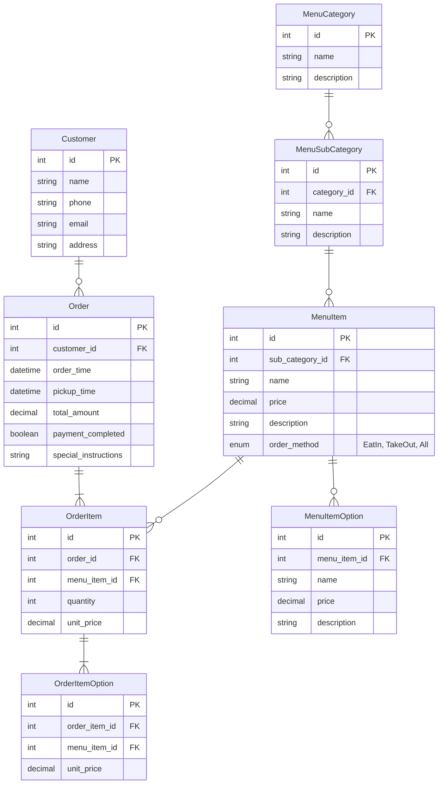

## ユースケースの定義

### データベースを使うシステムの具体的な利用場面を記述します。

- **注文**

  - 顧客がメニューから商品を選択し、注文を登録する

- **決済管理**

  - 合計金額を計算し、支払状況を管理する

- **商品**

  - カテゴリーから商品を管理し、表示する
  - オプションを作成し、商品と紐づける

## エンティティ

- 顧客（customer）
- 注文 (order)
- 注文商品(order_item)
- 商品（Menu_item）
- メニューカテゴリー (menu_category)
- メニューサブカテゴリー (menu_sab_category)

## ER 図



## 設計意図

### 1.テーブル名を単数形で統一

・複数形だと概念モデルとの不一致があり、認知負荷が高まりそうだと判断

```
customersテーブル → Customerクラス
orderItemsテーブル → orderItemクラス
```

下記の記事を参考に単数系で統一
https://zenn.dev/sakura7/articles/cf438b35fcccb3

### 2. 支払い済みか判定

・Order テーブルの payment_completed で決済済みか判断

### 3. 注文時の補足メモ

・Order テーブルの special_instructions で顧客からの要望を確認

例：おしぼりを 3 つと箸を二膳お願いします。

### 4. 注文確定時の商品金額の記録

・OrderItem テーブルの unit_price で注文時の商品金額を管理 (MenuItem テーブルの price は変更する可能性があるため)

### 5. カテゴリー分類

・お持ち帰りメニュー表では、セットメニュー、お好みすしのカテゴリー配下に盛り込みなどのサブカテゴリーがあったため、MenuCategory, SubMenuCategory テーブルを作成
・SubMenuCategory と商品(MenuItem)は１対多の関係

### 6. 注文方式を考慮

・お持ち帰りメニュー表に「貝類などは一部お持ち帰りいただけないものもあります。」との記載があったため店内飲食、お持ち帰りのみの商品などがあることを考慮するため、MenuItem テーブルに order_method を追加。

### 7. わさび有り/シャリの大小など

・個別にカラムを設けずに MenuItemOption、OrderItemOption テーブルを作成しました。

MenuItemOption（例）

| id  | menu_item_id |    name    | price |            description |
| :-- | -----------: | :--------: | :---: | ---------------------: |
| 1   |            1 |  わさび有  |   0   |   わさびを追加します。 |
| 2   |            1 | シャリ増量 |  50   | シャリを２倍にします。 |

## 今後予想される機能開発

1. ユーザー毎の商品お気に入り機能
2. 商品の在庫判定機能
