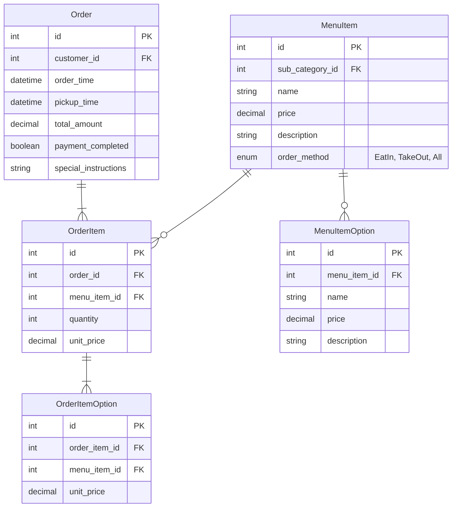

## 課題 2-1 わさびの有無以外にシャリの大小を選択できるようにする

課題 1-1 で作成した MenuItemOption、OrderItemOption テーブルを利用

商品は各オプションを全選択したものとし、OrderItem を作成する。5 皿注文のうち、2 皿シャリ増量、3 皿わさび有の場合は OrderItem を分ける。

#### **`OrderItem` テーブル**

| order_item_id | menu_item_id | quantity |
| ------------- | ------------ | -------- |
| 1             | 1            | 2        |
| 2             | 1            | 3        |

#### **`OrderItemOption` テーブル**

| id  | order_item_id | option_name | quantity |
| --- | ------------- | ----------- | -------- |
| 1   | 1             | シャリ増量  | 2        |
| 2   | 1             | わさび有    | 3        |

---

## 該当の ER 図

## OrderItemOption 方式 OrderItem カラム方式 比較

OrderItemOption 方式を採用。

### **概要**

| **項目**                 | **OrderItemOption 方式**                                                       | **OrderItem カラム方式**                                               |
| ------------------------ | ------------------------------------------------------------------------------ | ---------------------------------------------------------------------- |
| **基本設計**             | `OrderItemOption` テーブルでオプション（わさび・シャリ増量）を管理             | `OrderItem` テーブルに `with_wasabi` や `with_rice_large` カラムを追加 |
| **オプションの記録方法** | **わさび有り**や**シャリ増量**など、選択されたオプションのみを別テーブルに記録 | **オプションの有無ごとにレコードを分割**して管理                       |
| **デフォルトの扱い**     | **わさびなしがデフォルト** → わさび有りのみ記録                                | **カラムのデフォルト値**で管理（例：`with_wasabi = FALSE`）            |

---
