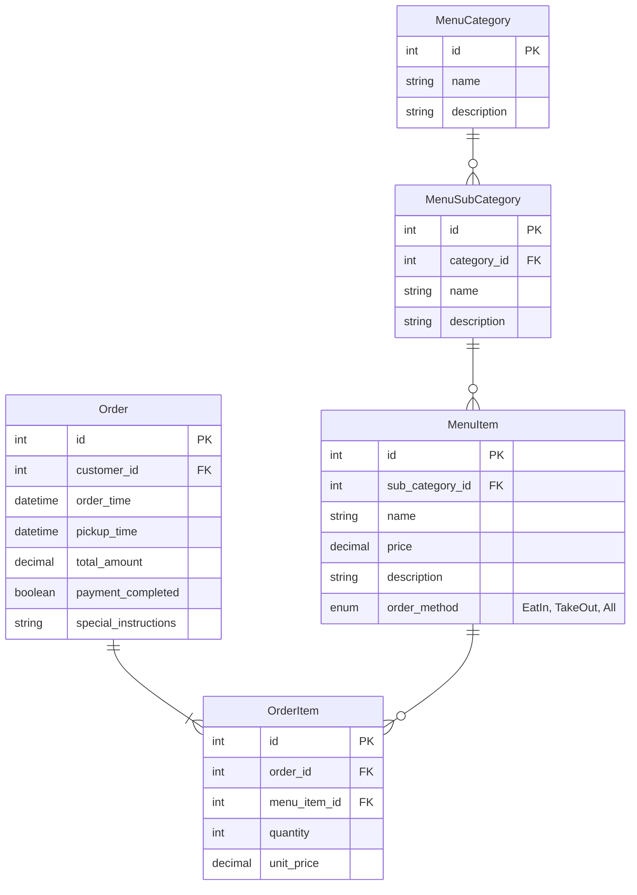

## 課題 2-2 月別寿司ネタ販売数集計

結論：既存のテーブル設計のまま対応。

### 目的

寿司ネタ（MenuItem）ごとの月別販売数を把握することで、人気商品や販売傾向を分析する。

### 現行のテーブル設計による対応

#### 注文 (order)

- 注文日時 (order_time)

#### 注文商品(order_item)

- 注文商品情報 (menu_item_id)
- 注文数 (quantity)

#### 商品（Menu_item）

- 商品 ID (id)
- 商品名 (name)

#### メニューカテゴリー（menu_category）

- カテゴリー名(name)

#### メニューサブカテゴリー（menu_sab_category）

- サブカテゴリー名(name)

## 該当の ER 図



### データ取得方法

Order テーブルと OrderItem テーブルを結合し、注文日時と商品ごとの数量を集計することで、月別の販売数を算出する。

#### SQL クエリ例

```
SELECT
    mi.name AS sushi_name,
    DATE_FORMAT(o.order_time, '%Y-%m') AS order_month,
    SUM(oi.quantity) AS total_quantity
FROM
    OrderItem oi
    JOIN `Order` o ON oi.order_id = o.id
    JOIN MenuItem mi ON oi.menu_item_id = mi.id
GROUP BY
    mi.name,
    DATE_FORMAT(o.order_time, '%Y-%m')
ORDER BY
    order_month,
    sushi_name;
```
