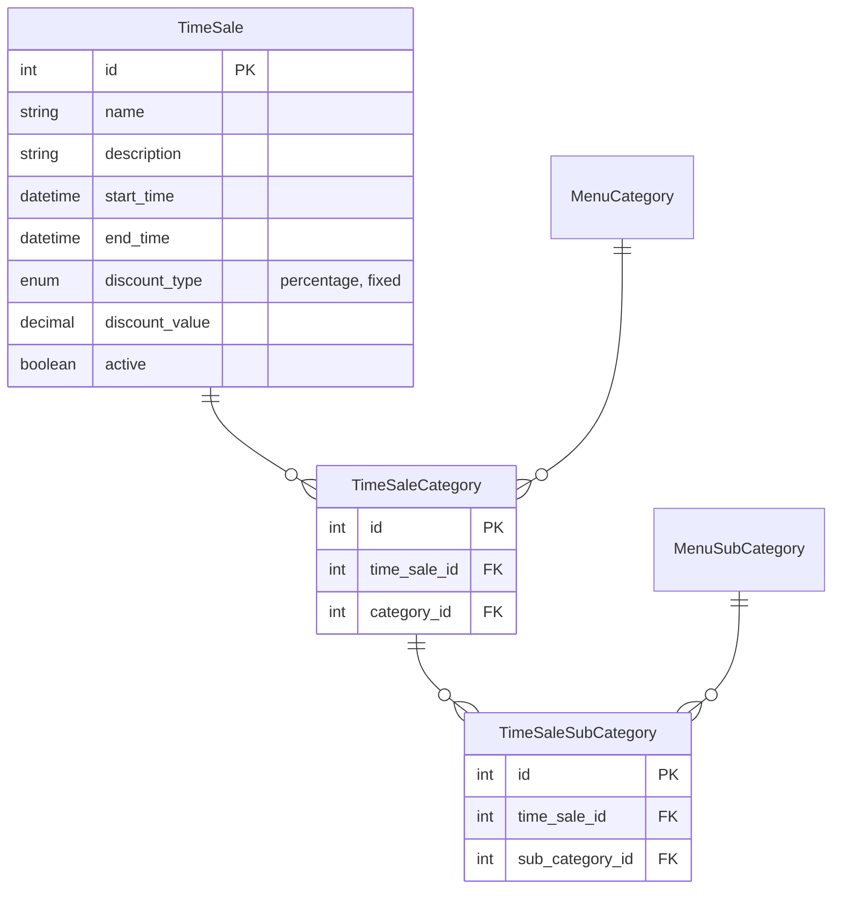

## 課題 2-3 タイムセール機能の追加

### 目的

日時を指定でき、該当カテゴリーの商品を割引できる

### 要件定義

**日時指定**

日時指定を行える。（TimeSale テーブルの start_time, end_time で管理）

例：2024/01/17 10:00 - 14:00

**割引額/割引率の指定可**

⚪︎⚪︎ 円引き、⚪︎%割引と定額割引と割引率ともに対応できる。

**商品カテゴリー別に対象範囲を指定可**

カテゴリー（セットメニュー, 握りすし）や、サブカテゴリー（盛り込み, 一皿 100 円）からタイムセールの対象を指定できる。

### 新規作成テーブル

- タイムセール (TimeSale)
- タイムセールカテゴリー (TimeSaleCategory)
- タイムセールサブカテゴリー(TimeSaleSubCategory)

## ER 図

