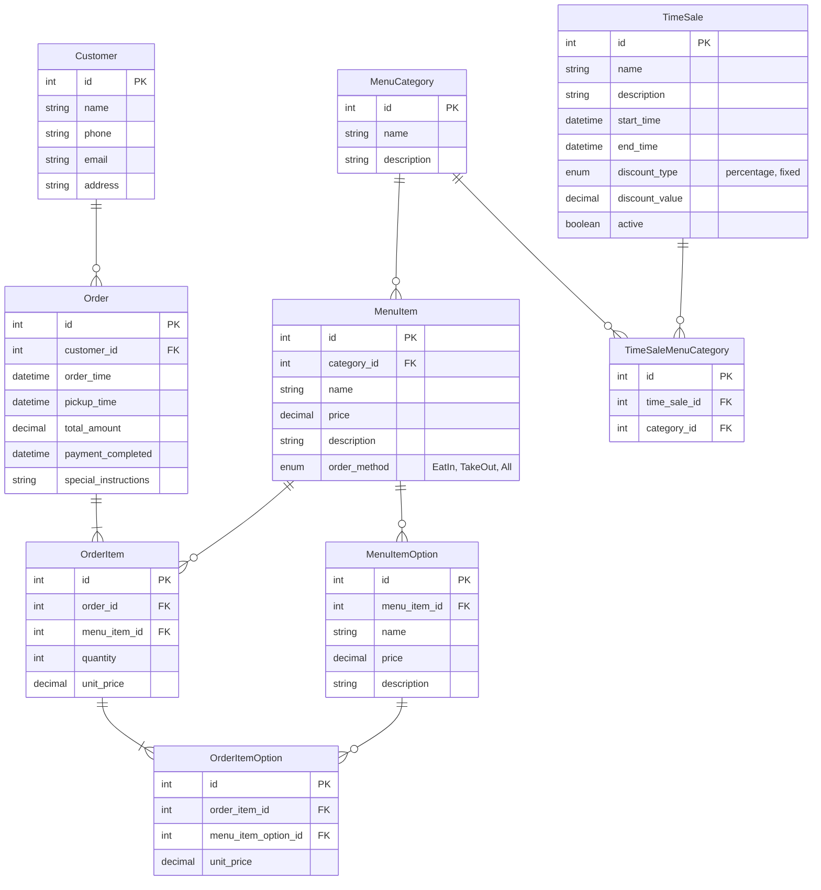

## 課題 3

### ER 図



### 設計したテーブルの DDL

```
-- 顧客
CREATE TABLE Customer (
    id INT PRIMARY KEY AUTO_INCREMENT,
    name VARCHAR(100),
    phone VARCHAR(20),
    email VARCHAR(100),
    address VARCHAR(255),
    created_at DATETIME DEFAULT CURRENT_TIMESTAMP,
    updated_at DATETIME DEFAULT CURRENT_TIMESTAMP ON UPDATE CURRENT_TIMESTAMP
);

-- メニューカテゴリー
CREATE TABLE MenuCategory (
    id INT PRIMARY KEY AUTO_INCREMENT,
    name VARCHAR(100),
    description TEXT,
    created_at DATETIME DEFAULT CURRENT_TIMESTAMP,
    updated_at DATETIME DEFAULT CURRENT_TIMESTAMP ON UPDATE CURRENT_TIMESTAMP
);

-- メニュー商品
CREATE TABLE MenuItem (
    id INT PRIMARY KEY AUTO_INCREMENT,
    category_id INT,
    name VARCHAR(100),
    price DECIMAL(10, 0),
    description TEXT,
    created_at DATETIME DEFAULT CURRENT_TIMESTAMP,
    updated_at DATETIME DEFAULT CURRENT_TIMESTAMP ON UPDATE CURRENT_TIMESTAMP,
    FOREIGN KEY (category_id) REFERENCES MenuCategory(id)
);

-- メニュー商品オプション
CREATE TABLE MenuItemOption (
    id INT PRIMARY KEY AUTO_INCREMENT,
    menu_item_id INT,
    name VARCHAR(100),
    description TEXT,
    price DECIMAL(10, 0),
    created_at DATETIME DEFAULT CURRENT_TIMESTAMP,
    updated_at DATETIME DEFAULT CURRENT_TIMESTAMP ON UPDATE CURRENT_TIMESTAMP,
    FOREIGN KEY (menu_item_id) REFERENCES MenuItem(id)
);

-- 注文情報
CREATE TABLE `Order` (
    id INT PRIMARY KEY AUTO_INCREMENT,
    customer_id INT,
    order_time DATETIME,
    pickup_time DATETIME,
    total_amount DECIMAL(10, 0),
    payment_completed DATETIME,
    special_instructions TEXT,
    created_at DATETIME DEFAULT CURRENT_TIMESTAMP,
    updated_at DATETIME DEFAULT CURRENT_TIMESTAMP ON UPDATE CURRENT_TIMESTAMP,
    FOREIGN KEY (customer_id) REFERENCES Customer(id)
);

-- 注文商品
CREATE TABLE OrderItem (
    id INT PRIMARY KEY AUTO_INCREMENT,
    order_id INT,
    menu_item_id INT,
    quantity INT,
    unit_price DECIMAL,
    created_at DATETIME DEFAULT CURRENT_TIMESTAMP,
    updated_at DATETIME DEFAULT CURRENT_TIMESTAMP ON UPDATE CURRENT_TIMESTAMP,
    FOREIGN KEY (order_id) REFERENCES `Order`(id),
    FOREIGN KEY (menu_item_id) REFERENCES MenuItem(id)
);

-- 注文商品オプション
CREATE TABLE OrderItemOption (
    id INT PRIMARY KEY AUTO_INCREMENT,
    order_item_id INT,
    menu_item_id INT,
    unit_price DECIMAL(10, 0),
    created_at DATETIME DEFAULT CURRENT_TIMESTAMP,
    updated_at DATETIME DEFAULT CURRENT_TIMESTAMP ON UPDATE CURRENT_TIMESTAMP,
    FOREIGN KEY (order_item_id) REFERENCES `OrderItem`(id),
    FOREIGN KEY (menu_item_id) REFERENCES MenuItem(id)
);


-- タイムセールス
CREATE TABLE TimeSale (
    id INT PRIMARY KEY AUTO_INCREMENT,
    name VARCHAR(100),
    description TEXT,
    start_time DATETIME,
    end_time DATETIME,
    discount_type ENUM("percentage", "fixed"),
    discount_value DECIMAL(10, 0),
    active BOOLEAN,
    created_at DATETIME DEFAULT CURRENT_TIMESTAMP,
    updated_at DATETIME DEFAULT CURRENT_TIMESTAMP ON UPDATE CURRENT_TIMESTAMP
);

-- タイムセールス対象カテゴリー
CREATE TABLE TimeSaleMenuCategory (
    id INT PRIMARY KEY AUTO_INCREMENT,
    time_sale_id INT,
    menu_category_id INT,
    created_at DATETIME DEFAULT CURRENT_TIMESTAMP,
    updated_at DATETIME DEFAULT CURRENT_TIMESTAMP ON UPDATE CURRENT_TIMESTAMP,
    FOREIGN KEY (time_sale_id) REFERENCES TimeSale(id),
    FOREIGN KEY (menu_category_id) REFERENCES MenuCategory(id)
);
```

### サンプルデータを投入する DML

```
-- 顧客データ
INSERT INTO Customer (name, phone, email, address)
VALUES ('田中 太郎', '080-1234-5678', 'taro@example.com', '東京都渋谷区1-2-3');

--メインカテゴリーデータ
INSERT INTO MenuCategory (name, description) VALUES ('お好みすし', 'お好みすしのカテゴリー');
INSERT INTO MenuCategory (name, description) VALUES ('セットメニュー', 'セットメニューのカテゴリー');

-- 商品データ
INSERT INTO MenuItem (category_id, name, price, description, order_method)
VALUES (1, 'サーモン寿司', 100, '新鮮なサーモンを使用した寿司', "TakeOut");

--商品オプションデータ
INSERT INTO MenuItemOption (menu_item_id, name, price, description) VALUES ("1", "わさび有", 0, "わさびが入ります。");

-- 注文データ
INSERT INTO `Order` (customer_id, order_time, pickup_time, total_amount, payment_completed, special_instructions)
VALUES (1, NOW(), NOW(), 1000, '2024-01-17 10:00:00', 'わさび抜きでお願いします');

-- 注文商品データ
INSERT INTO OrderItem (order_id, menu_item_id, quantity, unit_price)
VALUES (1, 1, 3, 100);

-- タイムセールデータ
INSERT INTO TimeSale (name, description, start_time, end_time, discount_type, discount_value, active)
VALUES ('昼割', '昼の時間帯限定10%オフ', '2024-01-17 10:00:00', '2024-01-17 14:00:00', 'percentage', 10, TRUE);

-- タイムセール対象カテゴリー
INSERT INTO TimeSaleMenuCategory (time_sale_id, menu_category_id) Values (1, 1);
```

### ユースケースを想定したクエリ

```
SELECT
    o.id AS order_id,
    c.name AS customer_name,
    SUM(oi.quantity * oi.unit_price + IFNULL(oio.unit_price, 0)) AS subtotal,
    IFNULL(ts.discount_value, 0) AS discount_value,
    ts.discount_type,
    CASE
        WHEN ts.discount_type = 'percentage' THEN
            ROUND(SUM(oi.quantity * oi.unit_price + IFNULL(oio.unit_price, 0)) * (1 - ts.discount_value / 100), 0)
        WHEN ts.discount_type = 'fixed' THEN
            GREATEST(SUM(oi.quantity * oi.unit_price + IFNULL(oio.unit_price, 0)) - ts.discount_value, 0)
        ELSE
            SUM(oi.quantity * oi.unit_price + IFNULL(oio.unit_price, 0))
    END AS final_amount
FROM `Order` o
INNER JOIN Customer c ON o.customer_id = c.id
INNER JOIN OrderItem oi ON o.id = oi.order_id
LEFT JOIN OrderItemOption oio ON oi.id = oio.order_item_id
LEFT JOIN TimeSaleMenuCategory tsmc ON oi.menu_item_id = tsmc.menu_category_id
LEFT JOIN TimeSale ts ON tsmc.time_sale_id = ts.id AND ts.active = TRUE
WHERE o.id = 1
GROUP BY o.id, c.name, ts.discount_value, ts.discount_type;
```

実行結果

```
+----------+---------------+----------+----------------+---------------+--------------+
| order_id | customer_name | subtotal | discount_value | discount_type | final_amount |
+----------+---------------+----------+----------------+---------------+--------------+
|        1 | 田中太郎       |      300 |              0 | NULL          |          300 |
+----------+---------------+----------+----------------+---------------+--------------+
```
