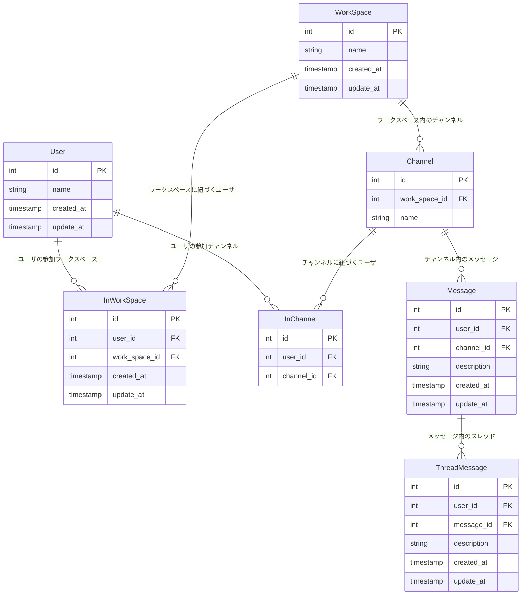

## 要件整理

### Message

- 誰が、どのチャネルに、いつ、どんな内容を投稿したのか分かること

### ThreadMessage

- 誰が、どのメッセージに、いつ、どんな内容をスレッドとして投稿したのか分かること

### Channel

- チャネルに所属しているユーザにしか、メッセージ・スレッドメッセージが見えないこと

### User

- ワークスペースに参加・脱退できること
- チャネルに参加・脱退できること

### Search Function

- メッセージとスレッドメッセージを横断的に検索できること（例えば「hoge」と検索したら、この文字列を含むメッセージとスレッドメッセージを両方とも取得できること）
- 参加していないチャネルのメッセージ・スレッドメッセージは検索できないこと

## ER 図



### 設計したテーブルの DDL

```
CREATE TABLE User (
  id INT AUTO_INCREMENT PRIMARY KEY,
  name VARCHAR(50) NOT NULL,
  created_at DATETIME DEFAULT CURRENT_TIMESTAMP,
  updated_at DATETIME DEFAULT CURRENT_TIMESTAMP ON UPDATE CURRENT_TIMESTAMP
);

CREATE TABLE WorkSpace (
  id INT AUTO_INCREMENT PRIMARY KEY,
  name VARCHAR(50) NOT NULL,
  created_at DATETIME DEFAULT CURRENT_TIMESTAMP,
  updated_at DATETIME DEFAULT CURRENT_TIMESTAMP ON UPDATE CURRENT_TIMESTAMP
);

CREATE TABLE InWorkSpace (
  id INT AUTO_INCREMENT PRIMARY KEY,
  user_id INT NOT NULL,
  work_space_id INT NOT NULL,
  created_at DATETIME DEFAULT CURRENT_TIMESTAMP,
  UNIQUE KEY uk_user_workspace(user_id, work_space_id),
  FOREIGN KEY(user_id) REFERENCES User(id),
  FOREIGN KEY(work_space_id) REFERENCES WorkSpace(id)
);

CREATE TABLE Channel (
  id INT AUTO_INCREMENT PRIMARY KEY,
  work_space_id INT,
  name VARCHAR(50) NOT NULL,
  created_at DATETIME DEFAULT CURRENT_TIMESTAMP,
  updated_at DATETIME DEFAULT CURRENT_TIMESTAMP ON UPDATE CURRENT_TIMESTAMP
);

CREATE TABLE InChannel (
  id INT AUTO_INCREMENT PRIMARY KEY,
  user_id INT,
  channel_id INT,
  created_at DATETIME DEFAULT CURRENT_TIMESTAMP,
  UNIQUE KEY uk_user_channel(user_id, channel_id),
  FOREIGN KEY(user_id) REFERENCES User(id),
  FOREIGN KEY(channel_id) REFERENCES Channel(id)
);

CREATE TABLE Message (
    id INT AUTO_INCREMENT PRIMARY KEY,
    user_id INT,
    channel_id INT,
    description TEXT NOT NULL,
    created_at DATETIME DEFAULT CURRENT_TIMESTAMP,
    updated_at DATETIME DEFAULT CURRENT_TIMESTAMP ON UPDATE CURRENT_TIMESTAMP
);

CREATE TABLE ThreadMessage (
    id INT AUTO_INCREMENT PRIMARY KEY,
    user_id INT,
    message_id INT,
    description TEXT NOT NULL,
    created_at DATETIME DEFAULT CURRENT_TIMESTAMP,
    updated_at DATETIME DEFAULT CURRENT_TIMESTAMP ON UPDATE CURRENT_TIMESTAMP
);
```

### サンプルデータを投入する DML

```
-- User
INSERT INTO User (name) VALUES ("name1");
INSERT INTO User (name) VALUES ("name2");

-- WorkSpace
INSERT INTO WorkSpace (name) VALUES ("work_space1");
INSERT INTO WorkSpace (name) VALUES ("work_space2");

-- InWorkSpace
INSERT INTO InWorkSpace (user_id, work_space_id) VALUES ("1", "1");
INSERT INTO InWorkSpace (user_id, work_space_id) VALUES ("2", "1");
INSERT INTO InWorkSpace (user_id, work_space_id) VALUES ("2", "2");

-- Channel
INSERT INTO Channel (work_space_id, name) VALUES ("1", "w1_channel1");
INSERT INTO Channel (work_space_id, name)  VALUES ("1", "w1_channel2");
INSERT INTO Channel (work_space_id, name) VALUES ("2", "w2_channel1");

-- InChannel
INSERT INTO InChannel (user_id, channel_id) VALUES ("1", "1");
INSERT INTO InChannel (user_id, channel_id) VALUES ("2", "1");
INSERT INTO InChannel (user_id, channel_id) VALUES ("2", "2");
INSERT INTO InChannel (user_id, channel_id) VALUES ("2", "3");


-- Message
INSERT INTO Message (user_id, channel_id, description) VALUES ("1", "1", "ch1_message1");
INSERT INTO Message (user_id, channel_id, description) VALUES ("1", "1", "ch1_message2");
INSERT INTO Message (user_id, channel_id, description) VALUES ("1", "1", "ch2_message1");
INSERT INTO Message (user_id, channel_id, description) VALUES ("2", "3", "ch3_message1");


-- ThreadMessage
INSERT INTO ThreadMessage (user_id, message_id, description) VALUES ("1", "1", "ch1_ms1_trms_1");
INSERT INTO ThreadMessage (user_id, message_id, description) VALUES ("1", "1", "ch1_ms1_trms_2");
INSERT INTO ThreadMessage (user_id, message_id, description) VALUES ("1", "3", "ch2_ms1_trms_1");
INSERT INTO ThreadMessage (user_id, message_id, description) VALUES ("1", "4", "ch3_ms1_trms_1");
```

### ユースケースを想定したクエリ

- メッセージ
  - 誰が、どのチャネルに、いつ、どんな内容を投稿したのか分かること

```
    SELECT
    　User.name AS user_name,
    　Channel.name AS channel_name,
    　Message.description,
    　Message.created_at
    FROM
    　Message
    JOIN
    　User ON Message.user_id = User.id
    JOIN
    　Channel ON Message.channel_id = Channel.id
    ORDER BY
   　 Message.created_at DESC;

```

- スレッドメッセージ
  - 誰が、どのメッセージに、いつ、どんな内容をスレッドとして投稿したのか分かること

```
SELECT
    　User.name AS user_name,
    　Message.description AS message_description,
    　ThreadMessage.description AS thread_message_description,
    　ThreadMessage.created_at AS thread_message_created_at
FROM
  　  ThreadMessage
JOIN
  　  User ON ThreadMessage.user_id = User.id
JOIN
 　   Message ON ThreadMessage.message_id = Message.id
ORDER BY
  　  ThreadMessage.created_at DESC;
```

- チャネル
  - そのチャネルに所属しているユーザにしか、メッセージ・スレッドメッセージが見えないこと
    -- メッセージを取得するクエリ

```
SELECT
    　User.name AS user_name,
    　Channel.name AS channel_name,
    　Message.description,
    　Message.created_at
    　FROM
    　Message
    　JOIN
    　User ON Message.user_id = User.id
JOIN
    　Channel ON Message.channel_id = Channel.id
JOIN
    　InChannel ON Channel.id = InChannel.channel_id AND     　InChannel.user_id = [対象ユーザの ID]
WHERE
    　Channel.id = [対象チャネルの ID]
ORDER BY Message.created_at DESC;
```

- スレッドメッセージを取得するクエリ

```
SELECT
      User.name As user_name,
      Channel.name As channel_name,
      Message.description As message_description,
      ThreadMessage.description,
      ThreadMessage.created_at
FROM ThreadMessage
JOIN User ON ThreadMessage.user_id = User.id
JOIN Message ON ThreadMessage.message_id = Message.id
JOIN Channel ON Message.channel_id = Channel.id
JOIN InChannel ON Channel.id = InChannel.channel_id AND InChannel.user_id = 1
WHERE Channel.id =  1
ORDER BY ThreadMessage.created_at ASC;
```

- ユーザ

  - ワークスペースに参加・脱退できること

    ```
    INSERT INTO InWorkSpace (user_id, work_space_id) VALUES (1, 2);
    DELETE FROM InWorkSpace WHERE user_id = 1 AND work_space_id = 2;
    ```

  - チャネルに参加・脱退できること

    ```
    INSERT INTO InChannel (user_id, channel_id) VALUES(1, 2);
    DELETE FROM InChannel WHERE user_id = 1 AND channel_id = 2;
    ```

- 横断機能

  - メッセージとスレッドメッセージを横断的に検索できること（例えば「hoge」と検索したら、この文字列を含むメッセージとスレッドメッセージを両方とも取得できること）

```
SELECT
    　"Message" As type,
　　 User.name As user_name,
    　Message.description As content,
    　Message.created_at
FROM
    　Message
JOIN
    　User ON Message.user_id = User.id
WHERE
    　Message.description LIKE [対象のテキスト]
UNION ALL
SELECT
    　"ThreadMessage" As type,
    　User.name As user_name,
    　ThreadMessage.description As content,
    　ThreadMessage.created_at
FROM
    　ThreadMessage
JOIN
    　User ON ThreadMessage.user_id = User.id
WHERE
    　ThreadMessage.description LIKE [対象のテキスト]
ORDER BY
    　created_at ASC;
```

- 参加していないチャネルのメッセージ・スレッドメッセージは検索できないこと

```
SELECT
    　"Message" As type,
　　 User.name As user_name,
    　Message.description As content,
    　Message.created_at
FROM
    　Message
JOIN
    　User ON Message.user_id = User.id
JOIN
    　Channel ON Message.channel_id = Channel.id
JOIN
    　InChannel ON Message.channel_id = InChannel.channel_id
WHERE
    　Message.description LIKE "%ch3%"
AND
    　InChannel.user_id = 2
UNION ALL
SELECT
    　"ThreadMessage" As type,
    　User.name As user_name,
    　ThreadMessage.description As content,
    　ThreadMessage.created_at
FROM
    　ThreadMessage
JOIN
    　User ON ThreadMessage.user_id = User.id
JOIN
    　Message ON ThreadMessage.message_id = Message.id
JOIN
    　Channel ON Message.channel_id = Channel.id
JOIN
    　InChannel ON Channel.id = InChannel.channel_id AND InChannel.user_id = User.id
WHERE
    　ThreadMessage.description LIKE "%ch3%"
AND
    　InChannel.user_id = 2
ORDER BY created_at ASC;
```

### 疑問点

- スレッド内のネストはアプリケーション側で id or created_at の昇降順で並べるだと問題ある？
