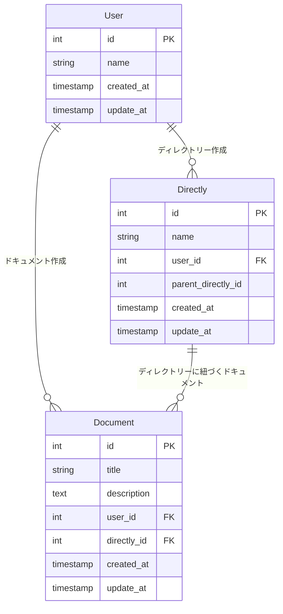

## 要件整理

### ドキュメント

- いつ、誰が、どんなテキスト情報を保存したのか管理する
- ドキュメントは必ず何らかのディレクトリに属する

### ディレクトリ

- 一つ以上のドキュメントを含む階層構造
- ディレクトリは無制限にサブディレクトリを持つことができる
- ディレクトリ構造は柔軟に変更可能。ディレクトリが移動してサブディレクトリになることもあり得る

### ユーザ

- ドキュメントを CRUD（作成、参照、更新、削除）できる
- ディレクトリを CRUD できる

## ER 図



### 設計したテーブルの DDL

```
CREATE TABLE User (
    id INT AUTO_INCREMENT PRIMARY KEY,
    name VARCHAR(50) NOT NULL,
    email VARCHAR(255) NOT NULL UNIQUE,
    created_at DATETIME DEFAULT CURRENT_TIMESTAMP,
    updated_at DATETIME DEFAULT CURRENT_TIMESTAMP ON UPDATE CURRENT_TIMESTAMP
);

CREATE TABLE Directly (
    id INT AUTO_INCREMENT PRIMARY KEY,
    name VARCHAR(50) NOT NULL,
    user_id INT,
    parent_directly_id INT,
    created_at DATETIME DEFAULT CURRENT_TIMESTAMP,
    updated_at DATETIME DEFAULT CURRENT_TIMESTAMP ON UPDATE CURRENT_TIMESTAMP
);

CREATE TABLE Document (
    id INT AUTO_INCREMENT PRIMARY KEY,
    name VARCHAR(50) NOT NULL,
    description TEXT NOT NULL,
    user_id INT,
    directly_id INT NOT NULL,
    created_at DATETIME DEFAULT CURRENT_TIMESTAMP,
    updated_at DATETIME DEFAULT CURRENT_TIMESTAMP ON UPDATE CURRENT_TIMESTAMP
);
```

### サンプルデータを投入する DML

```
-- User
INSERT INTO User (name, email) VALUES ("name1", "name1@test.com");
INSERT INTO User (name, email) VALUES ("name2","name2@test@com");

-- Directly
INSERT INTO Directly (name, user_id, parent_directly_id) VALUES ("directly1", 1, null);
INSERT INTO Directly (name, user_id, parent_directly_id) VALUES ("directly1-1", 1, 1);
INSERT INTO Directly (name, user_id, parent_directly_id) VALUES ("directly1-2", 2, 2);
INSERT INTO Directly (name, user_id, parent_directly_id) VALUES ("directly1-1-1", 1, 3);
INSERT INTO Directly (name, user_id, parent_directly_id) VALUES ("directly2", 1, null);

-- Document
INSERT INTO Document (title, description, user_id, directly_id) VALUES ("document1", "description1", 1, 1);
INSERT INTO Document (title, description, user_id, directly_id) VALUES ("document2", "description2", 2, 2);
INSERT INTO Document (title, description, user_id, directly_id) VALUES ("document3", "description3", 1, 3);
INSERT INTO Document (title, description, user_id, directly_id) VALUES ("document4", "description4", 2, 4);
INSERT INTO Document (title, description, user_id, directly_id) VALUES ("document5", "description5", 1, 5);
INSERT INTO Document (title, description, user_id, directly_id) VALUES ("document6", "description6", 2, 1);
```

### ユースケースを想定したクエリ

#### ドキュメント

- いつ、誰が、どんなテキスト情報を保存したのか管理する

```
SELECT
  User.name AS user_name,
  Document.title AS document_title,
  Document.description,
  Directly.name As directly_name,
  Document.created_at,
  Document.updated_at
FROM
  Document
JOIN
  User ON Document.user_id = User.id
JOIN
  Directly ON Document.directly_id = Directly.id
WHERE Directly.id = 1;

+-----------+----------------+--------------+---------------+---------------------+---------------------+
| user_name | document_title | description  | directly_name | created_at          | updated_at          |
+-----------+----------------+--------------+---------------+---------------------+---------------------+
| name1     | document1      | description1 | directly1     | 2025-02-24 03:31:08 | 2025-02-24 03:31:08 |
| name2     | document6      | description6 | directly1     | 2025-02-24 03:31:16 | 2025-02-24 03:31:16 |
+-----------+----------------+--------------+---------------+---------------------+---------------------+
2 rows in set (0.00 sec)
```

- ドキュメントの属するディレクトリを探す

```
SELECT
  Document.title,
  Document.description,
  Directly.name AS directly_name
FROM
  Document
JOIN
  Directly ON Document.directly_id = Directly.id
WHERE
  Document.id = 1;

+-----------+--------------+---------------+
| title     | description  | directly_name |
+-----------+--------------+---------------+
| document1 | description1 | directly1     |
+-----------+--------------+---------------+
1 row in set (0.00 sec)
```

#### ユーザ

- ドキュメントを CRUD（作成、参照、更新、削除）できる

```
INSERT INTO Directly (name, user_id, parent_directly_id) VALUES ("directly3", 1, null);
INSERT INTO Directly (name, user_id, parent_directly_id) VALUES ("directly3-1", 1, 1);
```

- ディレクトリを CRUD （作成、参照、更新、削除）できる

```
INSERT INTO Directly (name, user_id, parent_directly_id) VALUES ("directly1-1-1-1", 2, 4);
INSERT INTO Directly (name, user_id, parent_directly_id) VALUES ("directly3", 2, null);
```

#### ディレクトリ

- 一つ以上のドキュメントを含む階層構造

```
SELECT
  d.id AS directly_id,
  d.name AS directly_name,
  COUNT(doc.id) AS document_count
FROM
  Directly d
JOIN
  Document doc ON d.id = doc.directly_id
WHERE
  d.parent_directly_id IS NOT NULL
GROUP BY
  d.id, d.name;

+-------------+---------------+----------------+
| directly_id | directly_name | document_count |
+-------------+---------------+----------------+
|           2 | directly1-1   |              1 |
|           3 | directly1-2   |              1 |
|           4 | directly1-1-1 |              1 |
+-------------+---------------+----------------+
3 rows in set (0.01 sec)

```

- ディレクトリは無制限にサブディレクトリを持つことができる

```
SELECT
    grandparent.id AS grandparent_id,
    parent.id AS parent_id,
    child.id AS child_id,
    child.name AS child_name
FROM
    Directly AS grandparent
JOIN
    Directly AS parent ON grandparent.id = parent.parent_directly_id
JOIN
    Directly AS child ON parent.id = child.parent_directly_id;

+----------------+-----------+----------+-----------------+
| grandparent_id | parent_id | child_id | child_name      |
+----------------+-----------+----------+-----------------+
|              1 |         2 |        3 | directly1-2     |
|              2 |         3 |        4 | directly1-1-1   |
|              3 |         4 |        8 | directly1-1-1-1 |
+----------------+-----------+----------+-----------------+
3 rows in set (0.01 sec)
```

- ディレクトリ構造は柔軟に変更可能。ディレクトリが移動してサブディレクトリになることもあり得る

```

SELECT * FROM Directly;

+----+-----------------+---------+--------------------+---------------------+---------------------+
| id | name            | user_id | parent_directly_id | created_at          | updated_at          |
+----+-----------------+---------+--------------------+---------------------+---------------------+
|  1 | directly1       |       1 |               NULL | 2025-02-24 03:29:45 | 2025-02-24 03:29:45 |
|  2 | directly1-1     |       1 |                  1 | 2025-02-24 03:29:50 | 2025-02-24 03:29:50 |
|  3 | directly1-2     |       2 |                  2 | 2025-02-24 03:29:54 | 2025-02-24 03:29:54 |
|  4 | directly1-1-1   |       1 |                  3 | 2025-02-24 03:29:57 | 2025-02-24 03:29:57 |
|  5 | directly2       |       1 |               NULL | 2025-02-24 03:30:08 | 2025-02-24 03:30:08 |
|  6 | directly3       |       1 |               NULL | 2025-02-24 03:54:21 | 2025-02-24 03:54:21 |
|  7 | directly3-1     |       1 |                  1 | 2025-02-24 03:54:25 | 2025-02-24 03:54:25 |
|  8 | directly1-1-1-1 |       2 |                  4 | 2025-02-24 03:56:03 | 2025-02-24 03:56:03 |
|  9 | directly3       |       2 |               NULL | 2025-02-24 03:56:06 | 2025-02-24 03:56:06 |
+----+-----------------+---------+--------------------+---------------------+---------------------+

UPDATE Directly SET parent_directly_id = 9 WHERE id = 1;

// Query OK, 1 row affected (0.01 sec)


SELECT
    grandparent.id AS grandparent_id,
    parent.id AS parent_id,
    child.id AS child_id,
    child.name AS child_name
FROM
    Directly AS grandparent
JOIN
    Directly AS parent ON grandparent.id = parent.parent_directly_id
JOIN
    Directly AS child ON parent.id = child.parent_directly_id;

+----------------+-----------+----------+-----------------+
| grandparent_id | parent_id | child_id | child_name      |
+----------------+-----------+----------+-----------------+
|              9 |         1 |        2 | directly1-1     |
|              1 |         2 |        3 | directly1-2     |
|              2 |         3 |        4 | directly1-1-1   |
|              9 |         1 |        7 | directly3-1     |
|              3 |         4 |        8 | directly1-1-1-1 |
+----------------+-----------+----------+-----------------+

```
