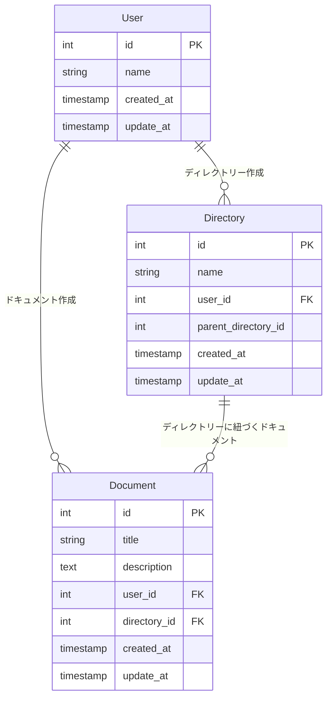

## 要件整理

### ドキュメント

- いつ、誰が、どんなテキスト情報を保存したのか管理する
- ドキュメントは必ず何らかのディレクトリに属する

### ディレクトリ

- 一つ以上のドキュメントを含む階層構造
- ディレクトリは無制限にサブディレクトリを持つことができる
- ディレクトリ構造は柔軟に変更可能。ディレクトリが移動してサブディレクトリになることもあり得る

### ユーザ

- ドキュメントを CRUD（作成、参照、更新、削除）できる
- ディレクトリを CRUD できる

## ER 図



### 設計したテーブルの DDL

```
-- User テーブル（PRIMARY KEY と UNIQUE 制約により、既に基本的なインデックスは作成されている）

CREATE TABLE User (
    id INT AUTO_INCREMENT PRIMARY KEY,
    name VARCHAR(50) NOT NULL,
    email VARCHAR(255) NOT NULL UNIQUE,
    created_at DATETIME DEFAULT CURRENT_TIMESTAMP,
    updated_at DATETIME DEFAULT CURRENT_TIMESTAMP ON UPDATE CURRENT_TIMESTAMP
);

-- Directoryテーブル（階層構造管理のため、親ディレクトリを示すカラムにインデックスを追加）
CREATE TABLE Directory (
    id INT AUTO_INCREMENT PRIMARY KEY,
    name VARCHAR(50) NOT NULL,
    user_id INT, -- NULLを許容
    parent_directory_id INT,
    created_at DATETIME DEFAULT CURRENT_TIMESTAMP,
    updated_at DATETIME DEFAULT CURRENT_TIMESTAMP ON UPDATE CURRENT_TIMESTAMP,
    CONSTRAINT fk_directory_user FOREIGN KEY (user_id) REFERENCES User(id) ON DELETE SET NULL,
    CONSTRAINT fk_directory_parent FOREIGN KEY (parent_directory_id) REFERENCES Directory(id) ON DELETE CASCADE,
    INDEX idx_directory_user_id (user_id),
    INDEX idx_directory_parent_id (parent_directory_id)
    ON DELETE SET NULL -- ユーザ削除時にNULLを設定
);

-- Documentテーブル（外部キーや頻繁に検索される列にインデックスを追加）
CREATE TABLE Document (
    id INT AUTO_INCREMENT PRIMARY KEY,
    title VARCHAR(50) NOT NULL,
    description TEXT NOT NULL,
    user_id INT,
    directory_id INT NOT NULL,
    created_at DATETIME DEFAULT CURRENT_TIMESTAMP,
    updated_at DATETIME DEFAULT CURRENT_TIMESTAMP ON UPDATE CURRENT_TIMESTAMP,
    CONSTRAINT fk_document_user FOREIGN KEY (user_id) REFERENCES User(id) ON DELETE SET NULL,
    CONSTRAINT fk_document_directory FOREIGN KEY (directory_id) REFERENCES Directory(id) ON DELETE CASCADE,
    INDEX idx_document_user_id (user_id),
    INDEX idx_document_directory_id (directory_id)
);
```

### サンプルデータを投入する DML

```
-- User
INSERT INTO User (name, email) VALUES ("name1", "name1@test.com");
INSERT INTO User (name, email) VALUES ("name2","name2@test.com");

-- Directory
INSERT INTO Directory (name, user_id, parent_directory_id) VALUES ("directory1", 1, NULL);
INSERT INTO Directory (name, user_id, parent_directory_id) VALUES ("directory1-1", 1, 1);
INSERT INTO Directory (name, user_id, parent_directory_id) VALUES ("directory1-2", 2, 2);
INSERT INTO Directory (name, user_id, parent_directory_id) VALUES ("directory1-1-1", 1, 3);
INSERT INTO Directory (name, user_id, parent_directory_id) VALUES ("directory2", 1, NULL);

-- Document
INSERT INTO Document (title, description, user_id, directory_id) VALUES ("document1", "description1", 1, 1);
INSERT INTO Document (title, description, user_id, directory_id) VALUES ("document2", "description2", 2, 2);
INSERT INTO Document (title, description, user_id, directory_id) VALUES ("document3", "description3", 1, 3);
INSERT INTO Document (title, description, user_id, directory_id) VALUES ("document4", "description4", 2, 4);
INSERT INTO Document (title, description, user_id, directory_id) VALUES ("document5", "description5", 1, 5);
INSERT INTO Document (title, description, user_id, directory_id) VALUES ("document6", "description6", 2, 1);
```

### ユースケースを想定したクエリ

#### ドキュメント

- いつ、誰が、どんなテキスト情報を保存したのか管理する

```
SELECT
  User.name AS user_name,
  Document.title AS document_title,
  Document.description,
  Directory.name As directory_name,
  Document.created_at,
  Document.updated_at
FROM
  Document
JOIN
  User ON Document.user_id = User.id
JOIN
  Directory ON Document.directory_id = Directory.id
WHERE Directory.id = 1;

+-----------+----------------+--------------+---------------+---------------------+---------------------+
| user_name | document_title | description  | directory_name | created_at          | updated_at          |
+-----------+----------------+--------------+---------------+---------------------+---------------------+
| name1     | document1      | description1 | directory1     | 2025-02-24 03:31:08 | 2025-02-24 03:31:08 |
| name2     | document6      | description6 | directory1     | 2025-02-24 03:31:16 | 2025-02-24 03:31:16 |
+-----------+----------------+--------------+---------------+---------------------+---------------------+
2 rows in set (0.00 sec)
```

- ドキュメントの属するディレクトリを探す

```
SELECT
  Document.title,
  Document.description,
  Directory.name AS directory_name
FROM
  Document
JOIN
  Directory ON Document.directory_id = Directory.id
WHERE
  Document.id = 1;

+-----------+--------------+---------------+
| title     | description  | directory_name |
+-----------+--------------+---------------+
| document1 | description1 | directory1     |
+-----------+--------------+---------------+
1 row in set (0.00 sec)
```

#### ユーザ

- ドキュメントを CRUD（作成、参照、更新、削除）できる

```
INSERT INTO Directory (name, user_id, parent_directory_id) VALUES ("directory3", 1, null);
INSERT INTO Directory (name, user_id, parent_directory_id) VALUES ("directory3-1", 1, 1);
```

- ディレクトリを CRUD （作成、参照、更新、削除）できる

```
INSERT INTO Directory (name, user_id, parent_directory_id) VALUES ("directory1-1-1-1", 2, 4);
INSERT INTO Directory (name, user_id, parent_directory_id) VALUES ("directory3", 2, null);
```

#### ディレクトリ

- 一つ以上のドキュメントを含む階層構造

```
SELECT
  d.id AS directory_id,
  d.name AS directory_name,
  COUNT(doc.id) AS document_count
FROM
  Directory d
JOIN
  Document doc ON d.id = doc.directory_id
WHERE
  d.parent_directory_id IS NOT NULL
GROUP BY
  d.id, d.name;

+-------------+---------------+----------------+
| directory_id | directory_name | document_count |
+-------------+---------------+----------------+
|           2 | directory1-1   |              1 |
|           3 | directory1-2   |              1 |
|           4 | directory1-1-1 |              1 |
+-------------+---------------+----------------+
3 rows in set (0.01 sec)

```

- ディレクトリは無制限にサブディレクトリを持つことができる

```
SELECT
    grandparent.id AS grandparent_id,
    parent.id AS parent_id,
    child.id AS child_id,
    child.name AS child_name
FROM
    Directory AS grandparent
JOIN
    Directory AS parent ON grandparent.id = parent.parent_directory_id
JOIN
    Directory AS child ON parent.id = child.parent_directory_id;

+----------------+-----------+----------+-----------------+
| grandparent_id | parent_id | child_id | child_name      |
+----------------+-----------+----------+-----------------+
|              1 |         2 |        3 | directory1-2     |
|              2 |         3 |        4 | directory1-1-1   |
|              3 |         4 |        8 | directory1-1-1-1 |
+----------------+-----------+----------+-----------------+
3 rows in set (0.01 sec)
```

- ディレクトリ構造は柔軟に変更可能。ディレクトリが移動してサブディレクトリになることもあり得る

```

SELECT * FROM Directory;

+----+-----------------+---------+--------------------+---------------------+---------------------+
| id | name            | user_id | parent_directory_id | created_at          | updated_at          |
+----+-----------------+---------+--------------------+---------------------+---------------------+
|  1 | directory1       |       1 |               NULL | 2025-02-24 03:29:45 | 2025-02-24 03:29:45 |
|  2 | directory1-1     |       1 |                  1 | 2025-02-24 03:29:50 | 2025-02-24 03:29:50 |
|  3 | directory1-2     |       2 |                  2 | 2025-02-24 03:29:54 | 2025-02-24 03:29:54 |
|  4 | directory1-1-1   |       1 |                  3 | 2025-02-24 03:29:57 | 2025-02-24 03:29:57 |
|  5 | directory2       |       1 |               NULL | 2025-02-24 03:30:08 | 2025-02-24 03:30:08 |
|  6 | directory3       |       1 |               NULL | 2025-02-24 03:54:21 | 2025-02-24 03:54:21 |
|  7 | directory3-1     |       1 |                  1 | 2025-02-24 03:54:25 | 2025-02-24 03:54:25 |
|  8 | directory1-1-1-1 |       2 |                  4 | 2025-02-24 03:56:03 | 2025-02-24 03:56:03 |
|  9 | directory3       |       2 |               NULL | 2025-02-24 03:56:06 | 2025-02-24 03:56:06 |
+----+-----------------+---------+--------------------+---------------------+---------------------+

UPDATE Directory SET parent_directory_id = 9 WHERE id = 1;

// Query OK, 1 row affected (0.01 sec)


SELECT
    grandparent.id AS grandparent_id,
    parent.id AS parent_id,
    child.id AS child_id,
    child.name AS child_name
FROM
    Directory AS grandparent
JOIN
    Directory AS parent ON grandparent.id = parent.parent_directory_id
JOIN
    Directory AS child ON parent.id = child.parent_directory_id;

+----------------+-----------+----------+-----------------+
| grandparent_id | parent_id | child_id | child_name      |
+----------------+-----------+----------+-----------------+
|              9 |         1 |        2 | directory1-1     |
|              1 |         2 |        3 | directory1-2     |
|              2 |         3 |        4 | directory1-1-1   |
|              9 |         1 |        7 | directory3-1     |
|              3 |         4 |        8 | directory1-1-1-1 |
+----------------+-----------+----------+-----------------+

```

### 課題

1. ディレクトリの階層構造の管理

ディレクトリのすべての子ディレクトリやドキュメントを取得する場合、
再帰的なクエリが必要になっているため、もう少しパフォーマンスを考慮した設計ができないか。

→ ネストセットモデル, 経路列挙モデルを検討

2. アクセス権限の管理

現在の設計では、すべてのユーザーがすべてのドキュメントやディレクトリを操作できてしまうため
サービスとしては、権限の管理が必要になりますが、今回の仕様には含まれていないため対象外としています。

3. データを論理 or 物理削除にするべきか

今回の仕様としては、ドキュメントの削除履歴までは保持する必要がないと判断し、物理削除をしております。
論理削除の場合、データとしては残ってしまうためパフォーマンス的にも好ましくないと判断しております。
