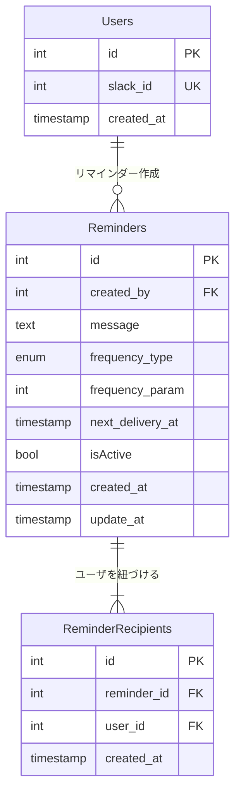

## 要件整理

リマインダーアプリ、[Penpen](https://penpen.netlify.app/) のデータベースを設計

経緯は[こちら](https://qiita.com/dowanna6/items/b5d1d0245985a26abf8e)

### リマインダー

- Slack に登録している他のユーザ（複数可）宛にリマインダーを設定できる
- リマインダーには送信相手、文面、頻度を指定可能
- 1 時間ごとにバッチが動き、配信が必要なリマインダーを指定された Slack ユーザに配信する

### リマインダーの周期

- 設定可能な周期は、現時点では以下の 4 種類（もしかすると今後増えるかもしれませんが、未定）
  - 毎日
  - X 日おき
  - 毎週 X 曜日
  - 毎月 X 日

## ER 図



## 送信フロー

1. ユーザが UI からリマインダーを作成

- Reeminders レコードを作成し、message や frequency_type/frequency_param を登録
- ReminderRecipients テーブルに送信対象をユーザを複数登録

2. バッチ処理(1 時間ごと・あるいは任意の間隔)

- Reminders テーブルから「next_delivery_at が現在時刻以前かつ, isActive = true」のレコードを取得

- 取得したリマインダー ID をキーに ReminderRecipients を参照し、関連するユーザをすべて取得

- Slack API などを介してメッセージを送信

- 送信が完了したら、Reminders テーブルの next_delivery_at を次回送信日時に更新(frequency_type/frequency_param を参照し演算)

## 設計意図

### 1. frequency_type と frequency_param の柔軟に設計

今後周期パターンが増える可能性も考慮し、カラム構成は汎用的にしています。

例：

- 毎月 1 日にリマインドしたい
  frequency_type = 'monthly' とし、 frequency_param = 1 で対応

- 2 週間おき（biweekly）にリマインドしたい
  frequency_type = 'biweekly' とし、 frequency_param = 2 で対応

- 毎週月曜日にリマインドしたい
  frequency_type = 'weekly' とし、 frequency_param = 1 で対応

- 毎日 14 時にリマインドしたい
  frequency_type = 'daily' とし、 frequency_param = 0,
  next_delivery_at = 2025-03-24 14:00:00 で対応
  送信するたびに next_delivery_at = next_delivery_at + 1 day に更新

### 2. 周期タイプ(frequency_type)を VARCHER で持つか ENUM で持つか

今回は"ENUM"で対応。
背景としては、仕様として「周期タイプは、今後増えるかもしれませんが、未定」と記載があるため頻繁に追加（または変更）される見込みが少ないと判断。
スキーマ変更のデメリットを考慮しつつも、DB レイヤーで厳密に制限できるメリットを選択してます。

### 3.バッチで更新

- 毎回リマインダーを送った直後に次の next_delivery_at を計算して更新すれば、バッチ実行時に単純なクエリで「送信すべきレコード」を取得しやすくなる

- 次回日時の計算ロジックは「frequency_type で判定」「frequency_param を使って日時演算」のように実装

### 4.Users テーブルの id は slack_id でもよいのか

slack_id も一意の値になるため、本題を取り上げましたが下記の理由から id カラムを残し slack_id にユニーク制約をかける対応とする。

- 外部サービスの ID は変わる可能性がある
  ユーザ ID 体系が変更されるリスクは外部サービスのため少なからずある。
  slack_id をアプリないの主キーとして使う = Slack の仕様や運用に強く依存する状態となり、万が一仕様が変わった際に影響が大きくなってしまう。

-サービス拡張時の柔軟性
将来、Slack 以外の外部サービスとも連携する可能性があるかも？

-パフォーマンスも考慮
一般的には文字列（可変長）より数値型の主キーの方が、インデックス利用などの面で高速

### 設計したテーブルの DDL

```
CREATE TABLE Users (
    id INT AUTO_INCREMENT PRIMARY KEY,  -- ユーザーの一意の識別子。自動的に増加する整数
    slack_id INT NOT NULL,             -- Slackのユーザーを識別するID。必須項目
    created_at DATETIME DEFAULT CURRENT_TIMESTAMP,  -- レコード作成日時。デフォルトで現在時刻
    UNIQUE KEY uk_slack_id (slack_id)  -- slack_idの重複を防ぐための制約
);

CREATE TABLE Reminders (
    id INT AUTO_INCREMENT PRIMARY KEY,  -- リマインダーの一意の識別子
    created_by INT NOT NULL,           -- リマインダーを作成したユーザーのID
    message TEXT NOT NULL,             -- リマインダーのメッセージ内容
    frequency_type ENUM('daily', 'weekly', 'monthly', 'biweekly') NOT NULL,  -- リマインダーの頻度タイプ
    frequency_param INT NOT NULL,      -- 頻度の具体的な値（例：毎月の何日）
    next_delivery_at DATETIME NOT NULL,  -- 次回の配信予定日時
    is_active BOOLEAN DEFAULT TRUE,    -- リマインダーが有効かどうか
    created_at DATETIME DEFAULT CURRENT_TIMESTAMP,  -- 作成日時
    updated_at DATETIME DEFAULT CURRENT_TIMESTAMP ON UPDATE CURRENT_TIMESTAMP,  -- 更新日時
    CONSTRAINT fk_reminder_creator FOREIGN KEY (created_by) REFERENCES Users(id)  -- Usersテーブルとの関連付け
    CONSTRAINT chk_frequency_param CHECK (
        (frequency_type = 'weekly' AND frequency_param BETWEEN 0 AND 6) OR  -- weekly: 0-6（日曜〜土曜）
        (frequency_type = 'monthly' AND frequency_param BETWEEN 1 AND 31) OR  -- monthly: 1-31（月の日付）
        (frequency_type = 'daily' AND frequency_param >= 0) OR  -- daily, biweekly: 0以上の値
        (frequency_type = 'biweekly' AND frequency_param >= 0)
    ),
    INDEX idx_next_delivery_active (next_delivery_at, is_active),
    INDEX idx_created_by (created_by)
);

CREATE TABLE ReminderRecipients (
    id INT AUTO_INCREMENT PRIMARY KEY,  -- 受信者エントリーの一意の識別子
    reminder_id INT NOT NULL,          -- 関連するリマインダーのID
    user_id INT NOT NULL,             -- 受信者のユーザーID
    created_at DATETIME DEFAULT CURRENT_TIMESTAMP,  -- 作成日時
    CONSTRAINT fk_reminder_id FOREIGN KEY (reminder_id) REFERENCES Reminders(id),  -- Remindersテーブルとの関連付け
    CONSTRAINT fk_recipient_user FOREIGN KEY (user_id) REFERENCES Users(id),      -- Usersテーブルとの関連付け
    UNIQUE KEY uk_reminder_user (reminder_id, user_id)  -- 同じリマインダーに同じユーザーを重複して登録できない
);

```

### サンプルデータを投入する DML

-- Users テーブルのサンプルデータ

```
INSERT INTO Users (slack_id) VALUES
(12345), -- user1
(67890), -- user2
(11111); -- user3
```

-- Reminders テーブルのサンプルデータ

```
INSERT INTO Reminders (
created_by,
message,
frequency_type,
frequency_param,
next_delivery_at
) VALUES
(1, '毎日の朝会の時間です', 'daily', 0, '2024-03-25 09:00:00'),
(1, '週次進捗報告をお願いします', 'weekly', 1, '2024-03-25 15:00:00'),
(2, '月次レポートの提出期限です', 'monthly', 1, '2024-04-01 10:00:00');
```

-- ReminderRecipients テーブルのサンプルデータ

```
INSERT INTO ReminderRecipients (reminder_id, user_id) VALUES
(1, 2), -- 朝会リマインド: user2 へ
(1, 3), -- 朝会リマインド: user3 へ
(2, 1), -- 週次進捗: user1 へ
(2, 2), -- 週次進捗: user2 へ
(3, 1), -- 月次レポート: user1 へ
(3, 2), -- 月次レポート: user2 へ
(3, 3); -- 月次レポート: user3 へ
```

### ユースケースを想定したクエリ

-- 1. 送信すべきリマインダーの取得（バッチ処理用）

```
SELECT r.\*, u.slack_id
FROM Reminders r
JOIN ReminderRecipients rr ON r.id = rr.reminder_id
JOIN Users u ON rr.user_id = u.id
WHERE r.next_delivery_at <= NOW()
AND r.is_active = TRUE
ORDER BY r.next_delivery_at;
```

-- 2. ユーザーが作成したリマインダー一覧の取得

```
SELECT r.\*, -- リマインダーの情報
COUNT(rr.id) as recipient_count -- 受信者数をカウント
FROM Reminders r
LEFT JOIN ReminderRecipients rr -- 受信者情報と結合
WHERE r.created_by = 1 -- 作成者 ID=1 のリマインダーのみ
GROUP BY r.id -- リマインダーごとにグループ化
ORDER BY r.created_at DESC;
```

-- 3. 特定のリマインダーの受信者一覧を取得

```
SELECT u.id, u.slack_id
FROM ReminderRecipients rr
JOIN Users u ON rr.user_id = u.id
WHERE rr.reminder_id = 1; -- 特定のリマインダー ID
```

-- 4. ユーザーが受信予定のリマインダー一覧を取得

```
SELECT r.\*, u.slack_id as creator_slack_id
FROM Reminders r
JOIN ReminderRecipients rr ON r.id = rr.reminder_id
JOIN Users u ON r.created_by = u.id
WHERE rr.user_id = 2 -- 特定のユーザー ID
AND r.is_active = TRUE
AND r.next_delivery_at > NOW()
ORDER BY r.next_delivery_at;
```

-- 5. 特定の周期タイプのリマインダー数を集計

```
SELECT frequency_type,
COUNT(\*) as reminder_count,
COUNT(DISTINCT created_by) as creator_count
FROM Reminders
WHERE is_active = TRUE
GROUP BY frequency_type;
```

-- 6. 非アクティブなリマインダーの一覧を取得

```
SELECT r.\*,
u.slack_id as creator_slack_id,
COUNT(rr.id) as recipient_count
FROM Reminders r
JOIN Users u ON r.created_by = u.id
LEFT JOIN ReminderRecipients rr ON r.id = rr.reminder_id
WHERE r.is_active = FALSE
GROUP BY r.id
ORDER BY r.updated_at DESC;
```

-- 7. 送信後の next_delivery_at を更新（頻度タイプごと）
-- daily（毎日）の場合：1 日（24 時間）追加

```
UPDATE Reminders
SET next_delivery_at = DATE_ADD(next_delivery_at, INTERVAL 1 DAY)
WHERE id = 1
```

-- weekly（毎週）の場合：7 日追加

```
UPDATE Reminders
SET next_delivery_at = DATE_ADD(next_delivery_at, INTERVAL 7 DAY)
WHERE id = 2
```

-- monthly（毎月）の場合：1 ヶ月追加

```
UPDATE Reminders
SET next_delivery_at = DATE_ADD(next_delivery_at, INTERVAL 1 MONTH)
WHERE id = 3
```

-- biweekly（隔週）の場合：14 日追加

```
UPDATE Reminders
SET next_delivery_at = DATE_ADD(next_delivery_at, INTERVAL 14 DAY)
WHERE id = 1
```
