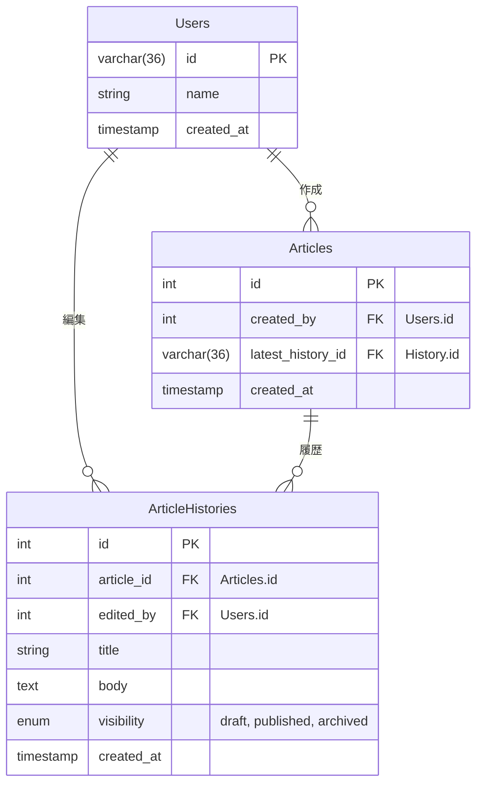

## ER 図

### 要件整理

記事と、その編集履歴を保存できるサービス（ブログサービスのようなもの）のデータベースを設計して、UML図を作成してください。
以下の機能を備えているものとします。

#### 記事
  1000文字程度の本文を記入して保存できる
#### 記事の履歴
  - 記事を更新すると履歴が保存される
  - 特定の記事の履歴を一覧表示できる
  - 履歴を選択して過去の記事状態に戻す事が可能

#### 記事の閲覧
  最新状態の記事を一覧表示できる

### 設計意図

- 最低限の仕様のみを考慮する

ユーザ情報の更新, 権限設定など"サービス的に必要そうな機能"は
今回未対応で要件のみを考慮とする。

- 削除は論理削除のみ

ArticleHistories.visibility でステータス(draft, published, archived)を管理しており
削除時は、archivedに変更するのみとする。

- UPDATEのSQLは(なるべく) 避ける

記事の更新のタイミングのみ、Articles.latest_history_idをUPDATEで更新しています。

取得 > 更新のサービスとして設計した場合に、最新履歴の取得方法が
Articles.latest_history_idであれば、JOIN + id 直参照になるのに対し
ArticleHistories.created_atの最新日時を取得する場合、サブクエリ + 集約になってしまうため
取得ケースの多いサービスでは、UPDATEで対応してもよいのかな？という判断です。
(ですが、編集のたびにUPDATEしなきゃいけないのは[usecase.sql](./usecase.sql)を書いてて微妙かなと思えてきました。。)
↑ご意見ぜひいただきたいです🙋

