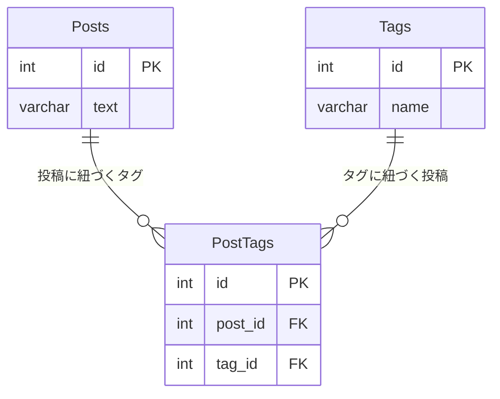

## 課題1-2

Postテーブルでtagsカラムの中にカンマ区切りで複数の値を入れている設計に対し
解決案として、スキーマ設計を行なってください。

## ER 図（最小限のデータのみを格納）

```mermaid
erDiagram
  Posts ||--o{ PostTags : "投稿に紐づくタグ"
  Tags ||--o{ PostTags : "タグに紐づく投稿"

  Posts {
  int id PK
  varchar text
  }

  PostTags {
  int id PK
  int post_id FK
  int tag_id FK
  }

  Tags {
  int id PK
  varchar name
  }
```