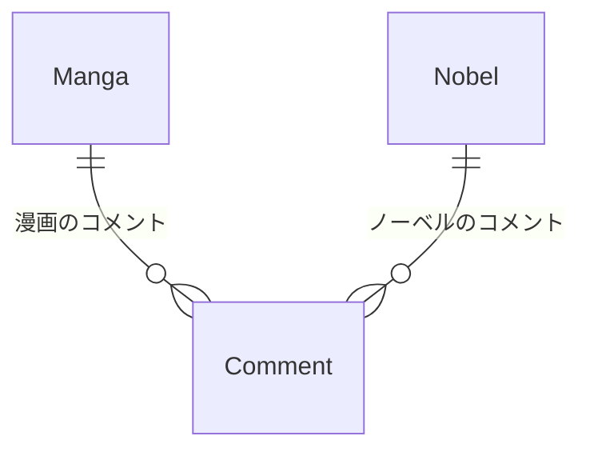

## 課題3-1

ref: https://separated-rover-67e.notion.site/1-f43cdd714e694a5fa34982ffc834c8d0

漫画、小説といった書籍を保存するDBがあり、それらにコメントできるようなサービスを題材とします。（[読書メーター](https://bookmeter.com/)みたいなサービスですね！）
「漫画と小説どちらにもコメントを紐付けられるようにしたい」という要望を受けて、前任のエンジニアは`belongs_to_id`を定義し、そこに`manga_id`あるいは`novel_id`を格納することで解決しました。また、`belongs_to_id`がmangaとnovelどちらを指しているのか判別できるよう`type`も追加しました。その場合、どのような問題が発生するでしょうか？

### アンチパターンの詳細

アンチパターン書籍、6章 ポリモーフィック関連に記載。

複数の親テーブルを参照する状態をポリモーフィック関連という。




### 問題点

1.外部キー制約が使えない
```
belongs_to_id が mangas.id か novels.id を指すため、DBレベルの 参照整合性を保証できない
```

2.クエリパフォーマンス低下
```
JOIN が複雑になり、インデックスが効きづらい

例：type = 'Manga' のときは mangas、type = 'Novel' のときは novels に結合する必要がある
```

3.データ整合性を担保しづらい
```
type = 'Manga' なのに belongs_to_id が novels.id を参照するような 矛盾したデータを防げない
```

4.保守性の低下
```
- コメントがどのエンティティに紐づいているかわかりづらい
- テーブルが増えるたびにtypeの分岐ロジックが膨張される
```