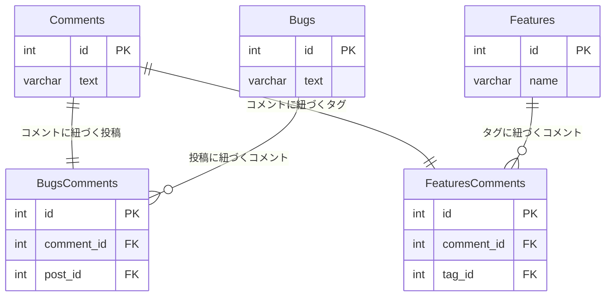

## 課題3-2

どのようにテーブル設計を見直せば[課題1](課題3-1.md)の問題は解決できるでしょうか？
新しいスキーマを描いてみてください。

### 書籍 アンチパターンから

6.5 解決策：関連（リレーションシップ）を単純化する参照(p74)

参照を逆にする

複数の外部キーを、Commentsテーブルを参照するために使う。
複数の親テーブルにそれぞれ対応した交差テーブルを作成し、各交差テーブルではCommentsへの外部キーに加えて各親テーブルへも同じく外部キーを定義します。

### ER 図

### 悩んだ点

Commentsテーブルの必要性について検討し、結果以下の理由から必要と判断。

1.コメントの一元管理ができる
 - 全てのコメントが一つのテーブルに集約されるため検索や集計しやすい

2.コメントの共通属性の重複を防げる
 - 作成日時、更新日時など1箇所で管理できる

3.コメントルールの一貫性
 - コメントの形式やルールの変更を1箇所で管理できる
