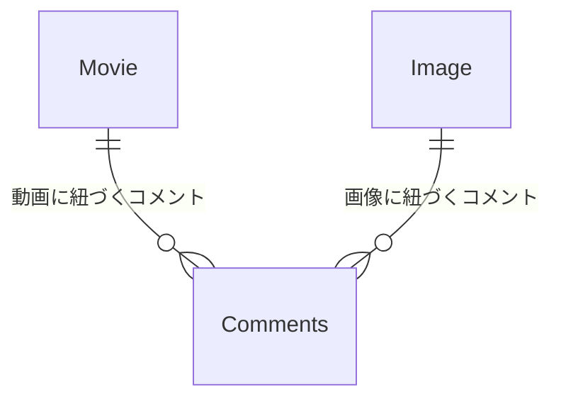
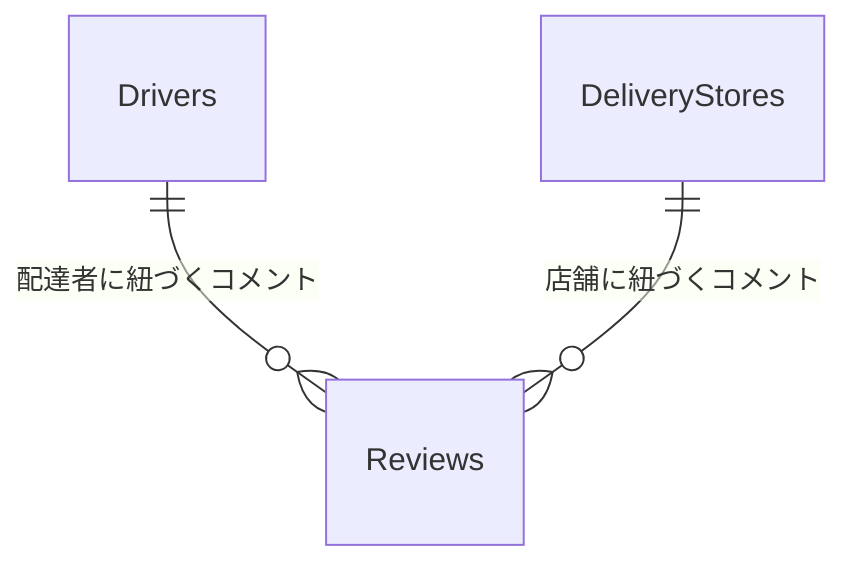

## 課題3-1

どんなサービスを開発している時に[課題1](https://www.notion.so/1-f43cdd714e694a5fa34982ffc834c8d0?pvs=21)のようなアンチパターンに陥りそうでしょうか？
最低でも1つは例を考えてみてください。

例：Twitterのようなサービスを開発していると仮定する

- 投稿に対するいいねとリツイートに対するいいねを管理したい
    - 「Like」「Tweet」「Retweet」テーブルが生まれて
    - 「Like」テーブルに`type`や`belongs_to_id`カラムが生まれるとアンチパターンに陥る、など

### サービス事例

#### 1.Facebook的な投稿サービス

動画や写真の投稿に対してコメントが可能。（お気に入りとかも該当しそう）

#### 2.Uber Eats的なデリバリーサービス

配達者店舗に対してレビューが可能。

