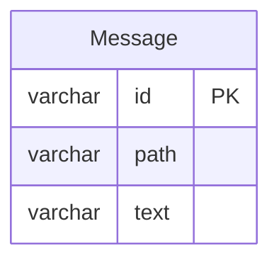
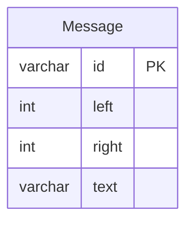
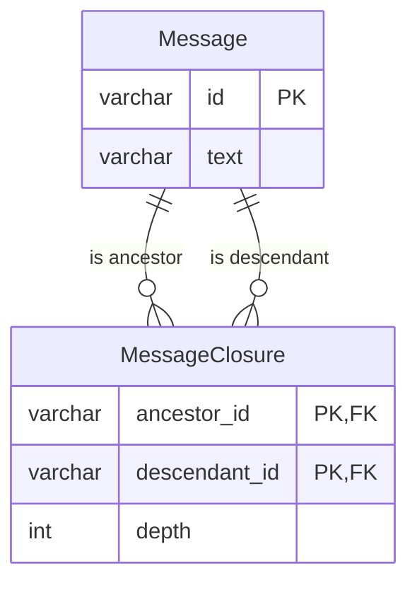

## 課題4-2

どのようにテーブル設計を見直せば[課題1](課題4-1.md)の問題は解決できるでしょうか？
新しいスキーマを描いてみてください。

### 書籍 アンチパターンから

6.5 解決策：代替ツリーモデルを使用する（p20）

経路列挙モデル(Path Enumeration), 入れ子集合モデル(Nested Set), 閉包テーブルモデル(Closure Table)などがあります。


### ER 図


#### 経路列挙モデル(Path Enumeration)

このモデルの特徴：
- pathカラムに階層パスを保存（例：/1/2/3/）
- シンプルな構造で、1つのテーブルで完結
- パスを見るだけで階層関係が分かる
- パスの正確な形成をデータベースでは保証できずアプリケーション側に依存する
- VARCHAR列の長さ=長さの制限になり、深さに限界がある



#### 入れ子集合モデル(Nested Set)

このモデルの特徴：
- leftとrightの数値で階層関係を表現
- 子孫の取得が容易
- 削除時に自動的に紐づいてくれる
- 更新操作が複雑（左右の値を再計算する必要がある）
- 読み取りが最優先される場合は候補になる



```
A
├── B
│   ├── D
│   └── E
└── C
    └── F
```

| id | left | right |
|----|------|-------|
| A | 1 | 12 |
| B | 2 | 7 |
| C | 8 | 11 |
| D | 3 | 4 |
| E | 5 | 6 |
| F | 9 | 10 |


#### 閉包テーブルモデル(Closure Table)

このモデルの特徴：
- 祖先と子孫の関係を別テーブルで管理
- 任意の深さの関係を効率的に取得可能
- ノードの移動や削除が比較的容易
- データの整合性維持が複雑
- ノードを追加・削除するたびに、親子関係をすべて更新する必要がある
- 挿入時に祖先の組み合わせ全てを考慮する必要あり




```
A
├── B
│   ├── D
│   └── E
└── C
    └── F
```


| ancestor_id | descendant_id | depth |
|-------------|---------------|-------|
| A | A | 0 |
| A | B | 1 |
| A | C | 1 |
| A | D | 2 |
| A | E | 2 |
| A | F | 2 |
| B | B | 0 |
| B | D | 1 |
| B | E | 1 |
| C | C | 0 |
| C | F | 1 |
| D | D | 0 |
| E | E | 0 |
| F | F | 0 |


## 各モデルの比較(2章 ナイーブツリーから抜粋)：

| 設計 | テーブル数 | 子へのクエリ実行 | ツリーへのクエリ実行 | 全体ツリーへのクエリ実行 | 挿入 | 削除 | 参照整合性維持 |
|--------|----------|------------|------------|----------------|------------|------------|------------|
| 隣接リスト | 1 | 簡単 | 難しい | 簡単 | 簡単 | 簡単 | 可能 |
| 再帰クエリ | 1 | 簡単 | 簡単 | 簡単 | 簡単 | 簡単 | 可能 |
| 経路列挙 | 1 | 簡単 | 簡単 | 簡単 | 簡単 | 簡単 | 不可 |
| 入れ子集合 | 1 | 難しい | 難しい | 難しい | 難しい | 難しい | 不可 |
| 閉包テーブル | 1 | 簡単 | 簡単 | 簡単 | 簡単 | 簡単 | 可能 |