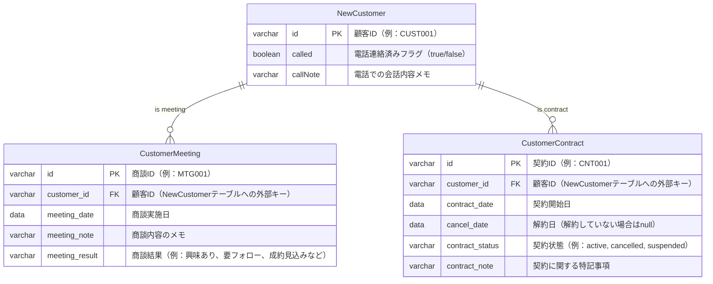

## 課題5-2

どのようにテーブル設計を見直せば[課題1](課題5-1.md)の問題は解決できるでしょうか？
新しいスキーマを描いてみてください。

### 新しいスキーマ定義後に解決する問題

- 複数回の商談を個別に記録できる
- 商談の履歴を時系列で管理できる
- 成約と解約の履歴を時系列で管理できる
- 顧客の契約履歴に関する詳細な分析が可能

### ER 図

```mermaid
erDiagram
  NewCustomer ||--o{ CustomerMeeting : "is meeting"
  NewCustomer ||--o{ CustomerContract : "is contract"

  NewCustomer {
    varchar id PK "顧客ID（例：CUST001）"
    boolean called "電話連絡済みフラグ（true/false）"
    varchar callNote "電話での会話内容メモ"
  }

  CustomerMeeting {
    varchar id PK "商談ID（例：MTG001）"
    varchar customer_id FK "顧客ID（NewCustomerテーブルへの外部キー）"
    data meeting_date "商談実施日"
    varchar meeting_note "商談内容のメモ"
    varchar meeting_result "商談結果（例：興味あり、要フォロー、成約見込みなど）"
  }

  CustomerContract {
    varchar id PK "契約ID（例：CNT001）"
    varchar customer_id FK "顧客ID（NewCustomerテーブルへの外部キー）"
    data contract_date "契約開始日"
    data cancel_date "解約日（解約していない場合はnull）"
    varchar contract_status "契約状態（例：active, cancelled, suspended）"
    varchar contract_note "契約に関する特記事項"
  }

```
