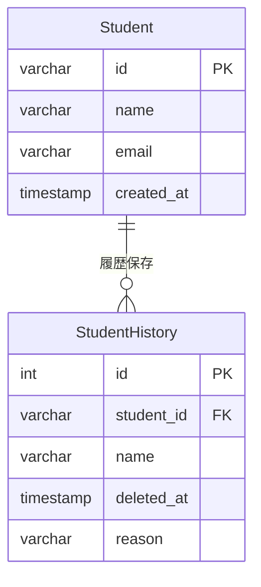
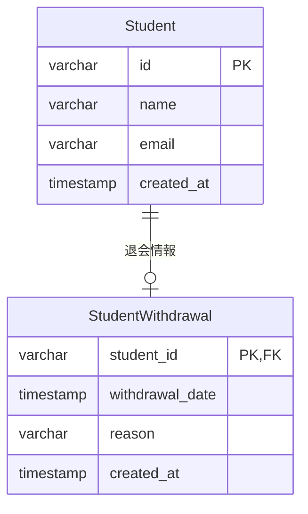
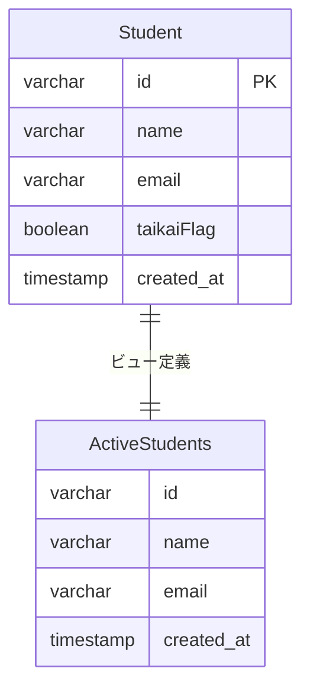

## 課題1-2

どのようにテーブル設計を見直せば課題1の問題は解決できるでしょうか？
新しいスキーマを考えて、UML図を描いてみてください。

### 解決策

#### 1. 物理削除 + バックアップ

**特徴:**
- 退会時は物理削除
- 履歴テーブルで削除情報を保持
- シンプルな構造だが、履歴テーブルの管理が必要

#### 2. 論理削除 + 専用テーブル

**特徴:**
- 退会情報を専用テーブルで管理
- 退会していないユーザーは退会テーブルにレコードなし
- 退会日時や理由などの詳細情報を保存可能

#### 3. ビューを使用（既存テーブルを活用）

**特徴:**
- 既存のフラグを活用
- ビューで有効ユーザーのみを表示
- 既存システムの改修が最小限

**選択基準:**
- **データ保持期間が短い場合**: 物理削除 + ログ
- **データ保持期間が長い場合**: 論理削除 + 専用テーブル
- **レガシーシステムの改修**: ビューの活用