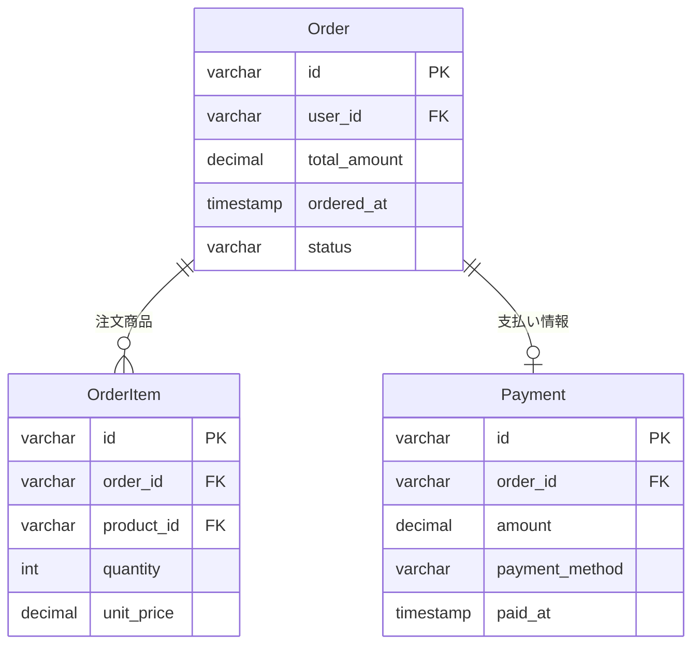
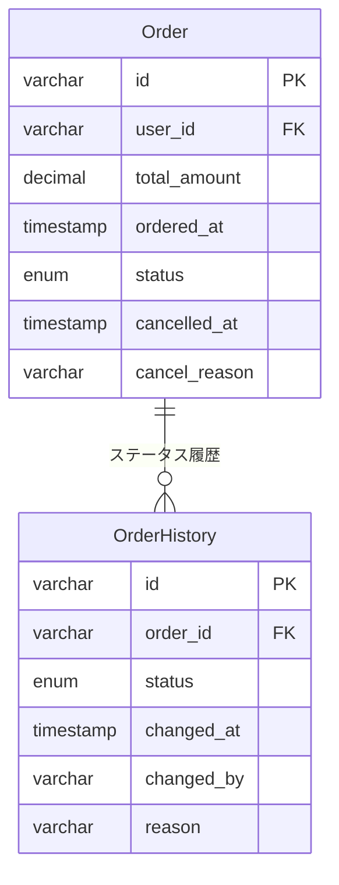
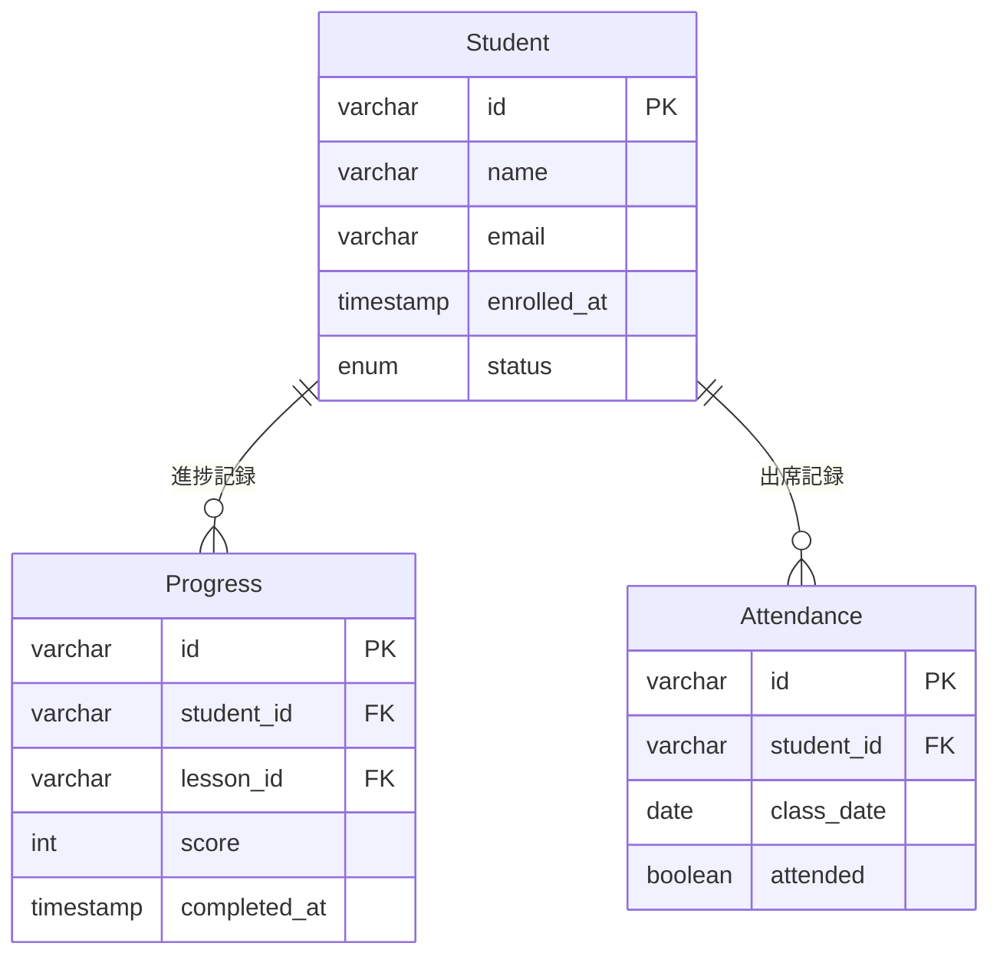
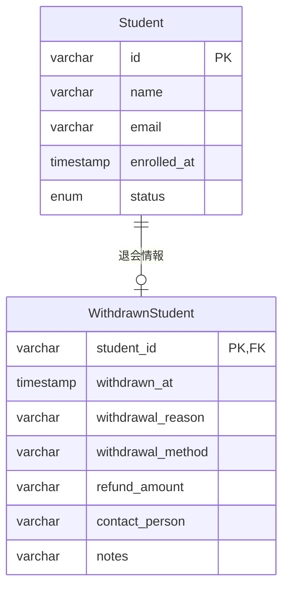

## 課題3-1

ユーザーの退会や注文の取り消しなど、何らかの履歴を無かったことにする際、DELETEクエリを発行してテーブルからデータを削除する「物理削除」を採用することがあるかもしれません。
しかし物理削除を安易に選択することでサービス上の重要な概念が見逃されてしまうこともあるため、時には注意が必要です。

例えばECサイトでの注文（Order）を取り消す機能の開発を指示された新人エンジニアが、Orderテーブルから対象の注文をid指定で削除するような機能を実装しました。
どのような問題が起き得るでしょうか？（想定する前提条件やユースケースによって回答が変わってくるので、ぜひ想像力をフル回転して様々なケースを想定してみてください！）

### ECサイト注文取り消しでの物理削除の問題点

#### 1. **会計上の問題**

**問題:**
- 売上データが消失し、正確な売上レポートが作成できない
- 税務申告に必要な売上データが欠損
- 会計監査で問題となる可能性

#### 2. **在庫管理の問題**
- 注文時に在庫を減らしたが、取り消し時に在庫を戻す処理が漏れる
- 実際の在庫数とシステム上の在庫数が不一致

#### 3. **顧客サポートの問題**
- 顧客から「注文を取り消したのに請求された」という問い合わせが来た際、証拠となる注文データが存在しない
- 返金処理の根拠となるデータが消失

#### 4. **分析・マーケティングの問題**
- 注文パターン分析ができない
- キャンセル率の分析ができない
- 商品の人気度分析に影響

#### 5. **法的問題**
- 消費者契約法に基づく記録保持義務違反
- 不正利用の調査時に証拠が残らない

### 推奨される解決策

## 課題2

例えば学習塾の進捗管理サービスで生徒（Student）の退会機能の開発を指示された新人エンジニアが、Studentテーブルから生徒をid指定で削除するような機能を実装しました。
どのような問題が起き得るでしょうか？

### 学習塾生徒退会での物理削除の問題点

#### 1. **進捗データの消失**

**問題:**
- 過去の学習進捗データが全て消失
- 再入会時の学習レベル判定ができない
- 学習効果の分析データが欠損

#### 2. **財務データの問題**
- 授業料の支払い履歴が消失
- 返金処理の根拠データが残らない
- 会計処理で問題が発生

#### 3. **コミュニケーション履歴の消失**
- 保護者との連絡履歴が消失
- 学習相談の記録が残らない
- 再入会時の対応が困難

#### 4. **統計・分析の問題**
- 退会率の分析ができない
- 学習継続期間の分析ができない
- 効果的な学習プログラムの開発に影響

#### 5. **法的・契約上の問題**
- 教育サービス提供記録の保持義務違反
- 契約解除の証拠が残らない

### 推奨される解決策

## 課題3 *任意

他にも、ご自身が過去に開発したサービスを振り返って、物理削除を採用したケースを思い出してみてください。今振り返ってみると、果たしてそれは妥当な物理削除だったでしょうか？

### 物理削除が妥当なケース

- 店舗側設定のクーポン情報削除
- 臨時営業時間の設定
- 登録クレジットカード情報

### 物理削除が適さないケース

- 注文商品の取り消し
- 支払い履歴消失
- クーポンの顧客利用履歴
