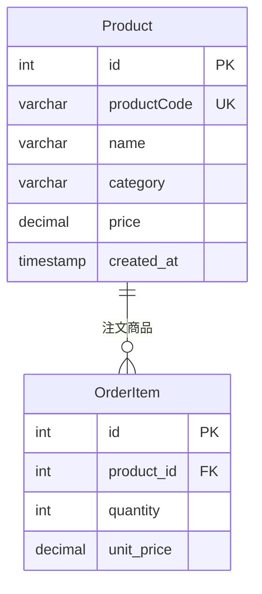
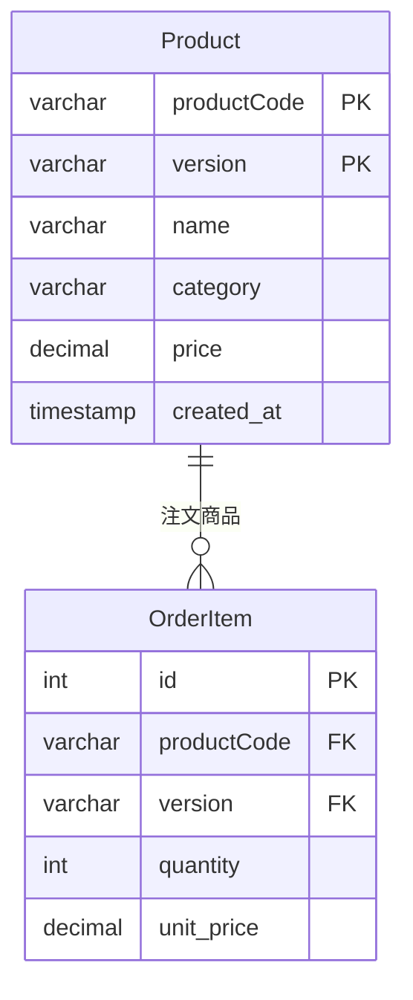
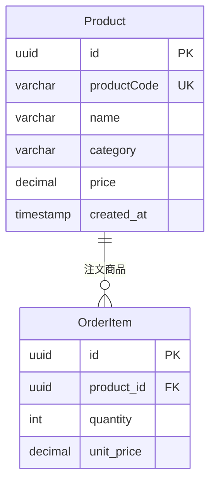

## 課題1-2

どのような主キーを設定すれば、課題1の問題は解決できるでしょうか？

### 解決策の比較

#### 1. **サロゲートキー（内部ID）を主キーに使用**



**メリット:**
- 内部IDは変更されないため、外部キー制約が安定
- 商品コードはビジネス要件に応じて変更可能
- パフォーマンスが向上（数値型の主キー）
- インデックス効率が良い

**デメリット:**
- 商品コードの一意性を別途管理する必要
- ビジネスロジックで商品コードを参照する際の追加クエリ

#### 2. **複合主キーの使用**



**メリット:**
- 商品コードの変更履歴を自然に管理
- バージョン管理が組み込まれている

**デメリット:**
- 外部キー制約が複雑
- クエリが複雑になる

#### 3. **UUID/GUIDの使用**



**メリット:**
- 分散システムでの一意性保証
- セキュリティ面での優位性

**デメリット:**
- ストレージ容量の増加
- インデックス効率の低下

### 推奨される解決策

#### 1. **内部ID + 商品コードの併用**

**メリット:**
- 内部IDは変更されないため、外部キー制約が安定
- 商品コードはビジネス要件に応じて変更可能
- パフォーマンスが向上（数値型の主キー）

#### 2. **商品コード履歴管理**

**メリット:**
- 商品コードの変更履歴を保持
- 過去の商品コードでも検索可能
- 監査証跡として活用

### 実装例

#### 推奨テーブル設計
```sql
-- 商品テーブル
CREATE TABLE Product (
    id INT AUTO_INCREMENT PRIMARY KEY,
    productCode VARCHAR(50) UNIQUE NOT NULL,
    name VARCHAR(255) NOT NULL,
    category VARCHAR(100),
    price DECIMAL(10,2),
    created_at TIMESTAMP DEFAULT CURRENT_TIMESTAMP,
    updated_at TIMESTAMP DEFAULT CURRENT_TIMESTAMP ON UPDATE CURRENT_TIMESTAMP
);

-- 商品コード履歴テーブル
CREATE TABLE ProductCodeHistory (
    id INT AUTO_INCREMENT PRIMARY KEY,
    product_id INT NOT NULL,
    old_productCode VARCHAR(50),
    new_productCode VARCHAR(50),
    changed_at TIMESTAMP DEFAULT CURRENT_TIMESTAMP,
    changed_by VARCHAR(100),
    reason VARCHAR(255),
    FOREIGN KEY (product_id) REFERENCES Product(id)
);
```

### 具体的な実装パターン

#### パターン1: シンプルな内部ID
```sql
-- 商品テーブル
CREATE TABLE Product (
    id BIGINT AUTO_INCREMENT PRIMARY KEY,
    product_code VARCHAR(50) UNIQUE NOT NULL,
    name VARCHAR(255) NOT NULL,
    INDEX idx_product_code (product_code)
);
```

#### パターン2: バージョン管理付き
```sql
-- 商品テーブル
CREATE TABLE Product (
    id BIGINT AUTO_INCREMENT PRIMARY KEY,
    product_code VARCHAR(50) NOT NULL,
    version INT NOT NULL DEFAULT 1,
    name VARCHAR(255) NOT NULL,
    UNIQUE KEY uk_product_version (product_code, version)
);
```

#### パターン3: 履歴管理付き
```sql
-- 商品テーブル
CREATE TABLE Product (
    id BIGINT AUTO_INCREMENT PRIMARY KEY,
    product_code VARCHAR(50) UNIQUE NOT NULL,
    name VARCHAR(255) NOT NULL,
    is_active BOOLEAN DEFAULT TRUE
);

-- 商品履歴テーブル
CREATE TABLE ProductHistory (
    id BIGINT AUTO_INCREMENT PRIMARY KEY,
    product_id BIGINT NOT NULL,
    product_code VARCHAR(50) NOT NULL,
    name VARCHAR(255) NOT NULL,
    changed_at TIMESTAMP DEFAULT CURRENT_TIMESTAMP,
    FOREIGN KEY (product_id) REFERENCES Product(id)
);
```

### 選択基準

#### 内部ID（サロゲートキー）を推奨する場合
- 大量データでのパフォーマンスが重要
- 外部キー制約が多い
- ビジネスキーの変更可能性がある
- システムの長期運用を考慮

#### ビジネスキーを推奨する場合
- データ量が少ない
- ビジネスキーが安定している
- 外部連携でビジネスキーが必須
- シンプルな設計が優先

#### UUIDを推奨する場合
- 分散システム
- セキュリティ要件が厳しい
- データベース間での一意性が必要
