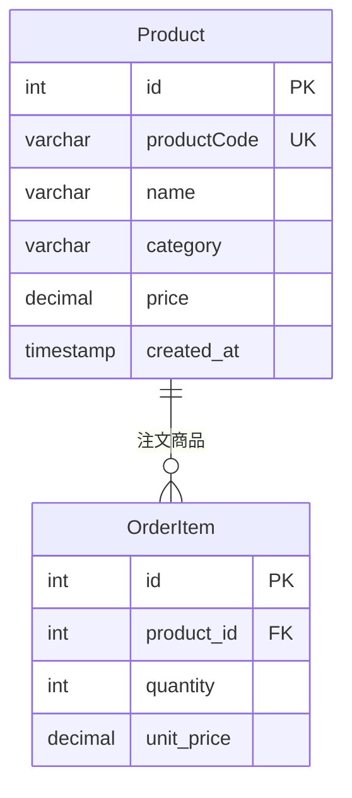
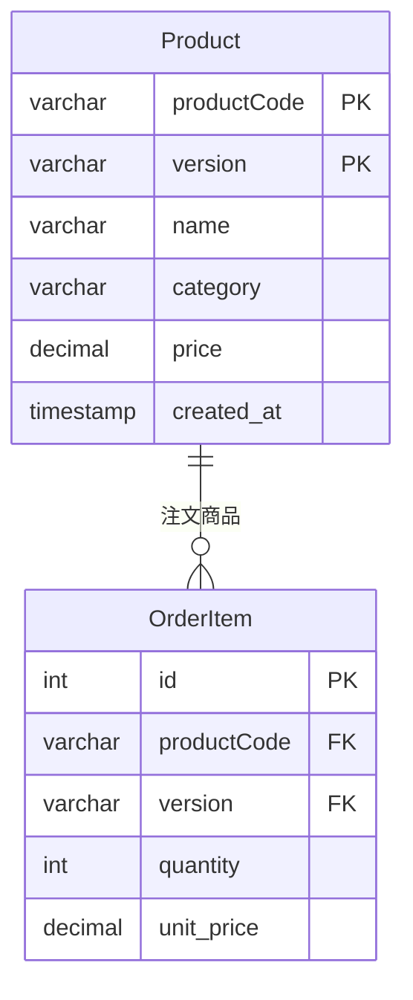

## 課題1-2

どのような主キーを設定すれば、課題1の問題は解決できるでしょうか？

### 解決策の比較

#### 1. **サロゲートキー（内部ID）を主キーに使用**

**メリット:**
- 内部IDは変更されないため、外部キー制約が安定
- 商品コードはビジネス要件に応じて変更可能
- パフォーマンスが向上（数値型の主キー）
- インデックス効率が良い

**デメリット:**
- 商品コードの一意性を別途管理する必要
- ビジネスロジックで商品コードを参照する際の追加クエリ

#### 2. **複合主キーの使用**

**メリット:**
- 商品コードの変更履歴を自然に管理
- バージョン管理が組み込まれている

**デメリット:**
- 外部キー制約が複雑
- クエリが複雑になる