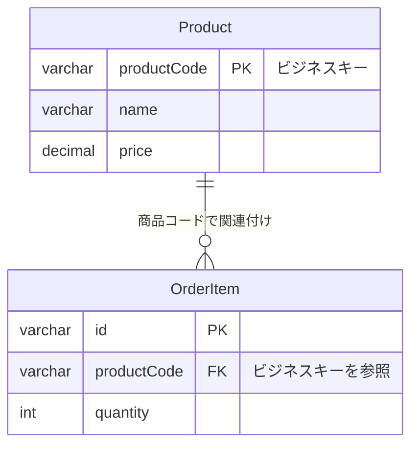
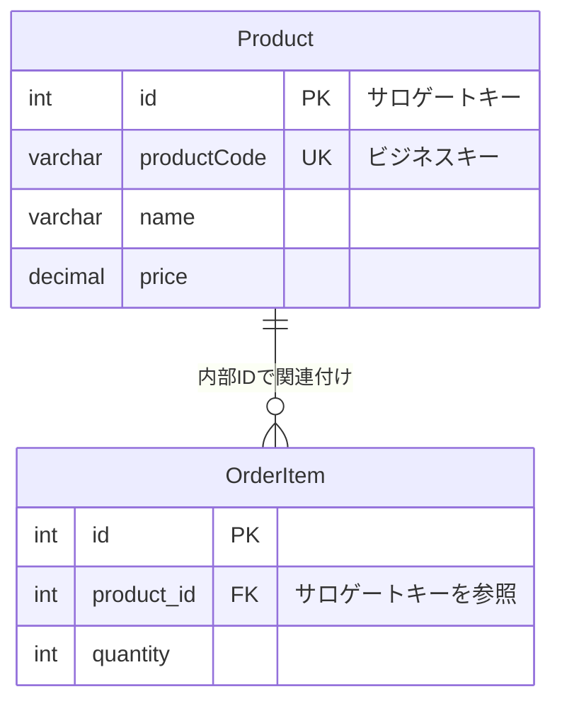

## 課題3-1

どんなサービスを開発している時に課題1のようなアンチパターンに陥りそうでしょうか？
最低でも1つは例を考えてみてください。

### サロゲートキーとは？

#### 定義
**サロゲートキー（Surrogate Key）**とは、データベース内でレコードを一意に識別するために、ビジネスロジックとは無関係にシステムが自動生成するキーのことです。

#### 特徴
- **ビジネス意味を持たない**: ユーザーから見て意味のある値ではない
- **自動生成**: システムが自動的に連番やUUIDを生成
- **変更されない**: 一度生成されたら変更されることはない
- **一意性保証**: データベース内で確実に一意

#### 具体例

```sql
-- サロゲートキーの例
CREATE TABLE Product (
    id INT AUTO_INCREMENT PRIMARY KEY,  -- ← これがサロゲートキー
    product_code VARCHAR(50) UNIQUE,    -- ← これがビジネスキー
    name VARCHAR(255),
    price DECIMAL(10,2)
);
```

### ビジネスキー vs サロゲートキー

#### ビジネスキー（Natural Key）


**特徴:**
- ビジネス上意味のある値
- ユーザーが理解できる
- 変更される可能性がある
- 例：商品コード、顧客番号、口座番号

#### サロゲートキー


**特徴:**
- ビジネス上意味のない値
- システムが自動生成
- 変更されることはない
- 例：AUTO_INCREMENT、UUID、GUID

### サロゲートキーの種類

#### 1. **連番（AUTO_INCREMENT）**
```sql
CREATE TABLE Product (
    id INT AUTO_INCREMENT PRIMARY KEY,  -- 1, 2, 3, 4, 5...
    product_code VARCHAR(50) UNIQUE,
    name VARCHAR(255)
);
```

**メリット:**
- パフォーマンスが良い
- ストレージ効率が良い
- 読みやすい

**デメリット:**
- 予測可能
- 分散システムでは重複の可能性

#### 2. **UUID/GUID**
```sql
CREATE TABLE Product (
    id UUID PRIMARY KEY DEFAULT gen_random_uuid(),
    product_code VARCHAR(50) UNIQUE,
    name VARCHAR(255)
);
-- 例: 550e8400-e29b-41d4-a716-446655440000
```

**メリット:**
- 分散システムで一意性保証
- 予測困難（セキュリティ面で優位）
- グローバルで一意

**デメリット:**
- ストレージ容量が大きい
- インデックス効率が悪い
- 読みにくい

#### 3. **ハッシュ値**
```sql
CREATE TABLE Product (
    id CHAR(32) PRIMARY KEY,  -- MD5ハッシュ
    product_code VARCHAR(50) UNIQUE,
    name VARCHAR(255)
);
-- 例: d41d8cd98f00b204e9800998ecf8427e
```

### サロゲートキーを使用する理由

#### 1. **パフォーマンス**
```sql
-- 数値型の比較は高速
WHERE id = 123

-- 文字列比較は相対的に低速
WHERE product_code = 'A106-2024'
```

#### 2. **安定性**
```sql
-- サロゲートキーは変更されない
UPDATE Product SET product_code = 'A106-2024' WHERE id = 123;
-- 外部キー制約は影響を受けない
```

#### 3. **拡張性**
```sql
-- ビジネスキーの形式変更に柔軟に対応
ALTER TABLE Product MODIFY COLUMN product_code VARCHAR(100);
-- サロゲートキーは影響を受けない
```

### 実装例

#### 推奨パターン
```sql
-- 商品テーブル
CREATE TABLE Product (
    id BIGINT AUTO_INCREMENT PRIMARY KEY,  -- サロゲートキー
    product_code VARCHAR(50) UNIQUE NOT NULL,  -- ビジネスキー
    name VARCHAR(255) NOT NULL,
    price DECIMAL(10,2),
    created_at TIMESTAMP DEFAULT CURRENT_TIMESTAMP
);

-- 注文商品テーブル
CREATE TABLE OrderItem (
    id BIGINT AUTO_INCREMENT PRIMARY KEY,
    order_id BIGINT NOT NULL,
    product_id BIGINT NOT NULL,  -- サロゲートキーを参照
    quantity INT NOT NULL,
    unit_price DECIMAL(10,2),
    FOREIGN KEY (product_id) REFERENCES Product(id)
);
```

#### クエリ例
```sql
-- 商品コードで検索（ビジネスキー使用）
SELECT * FROM Product WHERE product_code = 'A106';

-- 内部IDで検索（サロゲートキー使用）
SELECT * FROM Product WHERE id = 123;

-- JOIN時のパフォーマンス
SELECT p.name, oi.quantity 
FROM Product p 
JOIN OrderItem oi ON p.id = oi.product_id;  -- 数値比較で高速
```

### アンチパターンに陥りやすいサービスの例

#### 1. **銀行・金融サービス**

**問題点:**
- 口座番号が変更される可能性（銀行合併、システム移行など）
- 口座番号の形式変更（桁数増加、プレフィックス追加など）
- 関連する取引履歴の大量更新が必要

**影響:**
- 会計システムとの連携で問題発生
- 監査証跡の不整合
- 顧客サポートでの混乱

#### 2. **医療システム**

**問題点:**
- 患者IDの形式変更（地域統合、システム更新など）
- 保険証番号の変更
- 個人情報保護法によるID形式変更

**影響:**
- 診療記録の不整合
- 保険請求システムとの連携問題
- 医療事故調査時の証拠不足

#### 3. **学校・教育管理システム**

**問題点:**
- 学籍番号の形式変更（年度変更、学校統合など）
- クラス番号の変更
- 転校時の番号変更

**影響:**
- 成績履歴の不整合
- 進路指導データの欠損
- 卒業証明書の発行問題

#### 4. **ECサイト・在庫管理システム**

**問題点:**
- SKUコードの形式変更（商品カテゴリ変更、ブランド変更など）
- 商品コードの統一（複数ブランド統合など）
- 外部システムとの連携時の形式違い

**影響:**
- 在庫管理の不整合
- 売上レポートの不正確
- サプライチェーン管理の問題

#### 5. **不動産管理システム**

**問題点:**
- 物件コードの形式変更（地域コード変更、管理会社変更など）
- 住所表記の変更
- 物件番号の再編成

**影響:**
- 契約履歴の不整合
- 家賃管理の混乱
- 税務申告データの不正確

### 結論

**サロゲートキー**は、ビジネスロジックとは無関係にシステムが自動生成する一意の識別子です。主な特徴は：

1. **ビジネス意味を持たない**
2. **自動生成される**
3. **変更されない**
4. **パフォーマンスが良い**

**推奨アプローチ**: サロゲートキー（内部ID）を主キーとし、ビジネスキーをUNIQUE制約付きのカラムとして管理することで、安定性と柔軟性を両立できます。
